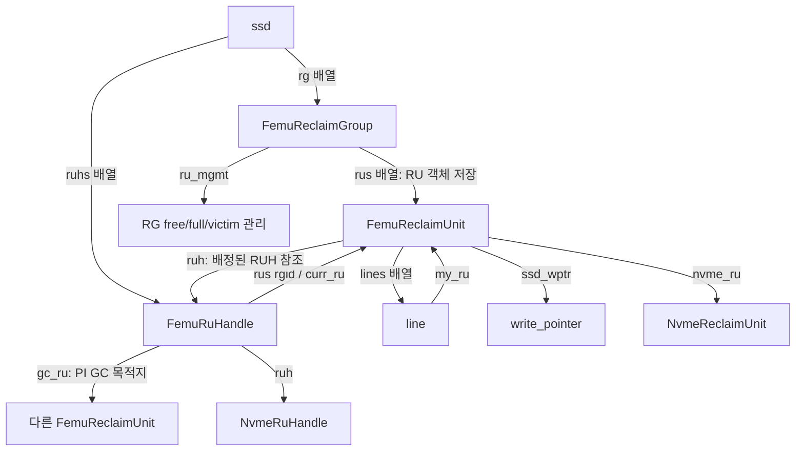

# 1단계 — FDP 객체 관계와 쓰기 포인터

기준: `master`, 커밋 `e2d5413ff`. 2026-09-17의 로컬 소스를 확인했다. 인용은 해당 소스의 발췌이며, 예시는 실행 결과가 아니다.

[전체 학습 계획](00_FDP_study_plan.md)

## 1. 이번 단원의 질문

**호스트가 선택한 배치가 FTL 안에서 어떤 객체를 거쳐 실제 쓰기 위치로 연결되는가?**

이번에는 RG·RU·RUH의 관계와 포인터를 이해한다. PID 비트 해석과 GC 알고리즘의 세부 계산은 다음 단원에서 다룬다. 이미 학습한 line·PPA·매핑의 기본 동작은 전제로 둔다.

| 이름 | 이 구현에서 맡는 역할 | 핵심 필드 |
|---|---|---|
| RG, Reclaim Group | RU 배열과 해당 그룹의 free/full/victim 관리를 보유 | `rus`, `tt_nru`, `ru_mgmt` |
| RU, Reclaim Unit | 여러 line을 묶을 수 있는 배치·회수 단위. 자체 쓰기 위치와 유효/무효 페이지 수 보유 | `lines`, `ssd_wptr`, `ruh`, `vpc`, `ipc` |
| RUH, Reclaim Unit Handle | 배치에 연결되는 핸들의 FTL 상태. 현재 호스트 쓰기 RU와 GC 목적지 등을 참조 | `ruhid`, `ruh_type`, `rus[]`, `curr_ru`, `gc_ru` |
| line | RU에 포함되는 기존 물리적 line 객체 | `my_ru` |

## 2. 먼저 객체 연결을 본다



RUH는 RG 안의 RU 배열을 통째로 소유하는 구조가 아니다. RG에 있는 RU를 할당받아 참조한다. 같은 RUH에 과거에 채운 RU와 현재 쓰는 RU가 함께 연결될 수 있으므로, `curr_ru` 하나가 그 RUH의 전체 데이터를 대표하지 않는다.

## 3. RG: RU 공간과 관리 상태를 묶는다
출처: [ftl.h:292–297](/root/workspace/FEMU/hw/femu/bbssd/ftl.h:292)

```c
struct FemuReclaimGroup {
    int rgidx;
    FemuReclaimUnit *rus;
    int tt_nru;
    struct ru_mgmt *ru_mgmt;
};
```

`rgidx`는 그룹 식별자이고, `rus`는 그 그룹의 `FemuReclaimUnit` 객체 배열이다. `tt_nru`는 RU 개수, `ru_mgmt`는 그 RU들의 상태를 관리하는 별도 객체다.

여기서 RUH에도 `rus`라는 필드가 있다는 점을 주의한다. 이름은 같지만 자료형과 의미가 다르다.

| 식 | 자료형 | 의미 |
|---|---|---|
| `rg->rus` | `FemuReclaimUnit *` | RG의 RU 객체 배열 |
| `&rg->rus[j]` | `FemuReclaimUnit *` | RG 내부 j번째 RU 객체 주소 |
| `ruh->rus` | `FemuReclaimUnit **` | RG별 RU 포인터 배열 |
| `ruh->rus[rgid]` | `FemuReclaimUnit *` | 해당 RUH가 그 RG에서 참조하는 RU |

RU 배정 시 실제 공간은 다음과 같이 RG의 free 목록에서 가져온다.
출처: [ftl.c:1093–1101](/root/workspace/FEMU/hw/femu/bbssd/ftl.c:1093)

```c
    ru = QTAILQ_FIRST(&rm->free_ru_list);
    if (!ru) {
        ftl_err("No free RUs left in rg[%d]\n", rg->rgidx);
        return NULL;
    }

    QTAILQ_REMOVE(&rm->free_ru_list, ru, entry);
    rm->free_ru_cnt--;
    return ru;
```

성공하면 해당 RU를 free 목록에서 빼고 `free_ru_cnt`를 1 줄인다. 목록이 비어 있으면 `NULL`을 반환한다. 따라서 RUH별 배치가 나뉘어 있어도, 이 함수의 공간 할당 출처는 RG의 free RU 목록이다.

## 4. RU: line, 소유 RUH, 쓰기 위치를 연결한다
출처: [ftl.h:251–265](/root/workspace/FEMU/hw/femu/bbssd/ftl.h:251)

```c
struct FemuReclaimUnit {
    uint16_t ruidx;
    uint16_t rgidx;
    NvmeReclaimUnit *nvme_ru;
    FemuRuHandle *ruh;
    struct write_pointer *ssd_wptr;
    struct line **lines;
    QTAILQ_ENTRY(FemuReclaimUnit) entry;
    int vpc;
    int ipc;
    int pos;       /* heap index in the per-RG (global) victim pqueue */
    int ruh_pos;   /* heap index in the per-RUH victim pqueue (PI RUHs) */
    int n_lines;
    int next_line_index;
    int npages;
```

- `ruidx`, `rgidx`: 어느 RG의 어느 RU인지 식별한다. RU 번호는 RG와 함께 읽는다.
- `ruh`: 이 RU에 배정된 FTL 측 RUH를 가리킨다. free RU의 비어 있지 않은 포인터만 보고 현재 사용 중이라고 판단하면 안 된다. 목록 소속과 할당 상태도 확인해야 한다.
- `ssd_wptr`: **이 RU의 다음 쓰기 위치**다. 실제 PPA를 만드는 데 사용하는 좌표는 RU 쪽에 있다.
- `lines`, `n_lines`, `npages`: 포함된 line들과 RU 용량이다.
- `vpc`, `ipc`: 해당 RU의 유효·무효 페이지 수다.
- `pos`, `ruh_pos`: 서로 다른 victim heap 안에서의 위치다. 물리 주소가 아니다.

현재 초기화는 RU 하나를 line 하나로 설정한다.
출처: [ftl.c:2391–2394](/root/workspace/FEMU/hw/femu/bbssd/ftl.c:2391)

```c
    uint64_t runs = endgrp->fdp.runs;

    /* lines_per_ru: how many lines (superblocks) per reclaim unit */
    spp->lines_per_ru = 1; /* M1: 1 line per RU for simplicity */
```

따라서 **현재 설정에서는 RU 1개 = line 1개**다. 구조체가 여러 line을 담을 수 있다는 사실과 현재 실제 설정을 구분해야 한다. `runs`가 읽힌다는 이유만으로 이 함수가 그 값에서 `lines_per_ru`를 계산한다고 해석해서도 안 된다.

line에서 RU로 돌아가는 연결도 초기화된다.
출처: [ftl.c:2230–2239](/root/workspace/FEMU/hw/femu/bbssd/ftl.c:2230)

```c
    femu_ru->lines = g_malloc0(femu_ru->n_lines * sizeof(struct line *));
    for (int i = 0; i < femu_ru->n_lines; i++) {
        femu_ru->lines[i] = get_next_free_line(ssd);
        if (!femu_ru->lines[i]) {
            ftl_err("FDP: no free line for RU %d (rg %d, line %d/%d)\n",
                    index, rgidx, i, femu_ru->n_lines);
            abort();
        }
        femu_ru->lines[i]->my_ru = femu_ru;
    }
```

`get_next_free_line()`으로 받은 line 주소를 RU에 저장하고, 그 line의 `my_ru`를 해당 RU로 설정한다. 이후 기존 PPA의 line을 찾으면 소속 RU까지 추적할 수 있다. 이것이 덮어쓰기 무효화를 RU 통계로 전달하는 연결점이다.

## 5. RUH: 현재 쓰기 RU와 GC 쓰기 RU를 참조한다
출처: [ftl.h:276–290](/root/workspace/FEMU/hw/femu/bbssd/ftl.h:276)

```c
struct FemuRuHandle {
    uint16_t ruh_type;
    uint16_t ruhid;
    int ru_in_use_cnt;
    int ruh_live_pages_cnt;
    uint16_t curr_rg;
    NvmeRuHandle *ruh;
    FemuReclaimUnit **rus;
    FemuReclaimUnit *curr_ru;
    FemuReclaimUnit *gc_ru;
    struct ru_mgmt *ru_mgmt;
    uint64_t hbmw;
    uint64_t mbmw;
    uint64_t mbe;
};
```

| 필드 | 읽는 방법 |
|---|---|
| `ruh_type` | II/PI 등 격리 유형에 따른 분기 기준 |
| `ruhid` | `ssd->ruhs`에서 사용하는 RUH 식별자 |
| `ru_in_use_cnt` | 배정된 RU 수를 추적하는 카운터. 현재 쓰는 RU 하나만 세는 필드가 아님 |
| `ruh_live_pages_cnt` | 해당 RUH에 속하는 유효 페이지 수를 추적하는 카운터 |
| `rus[rgid]` | RG별 RU 참조 |
| `curr_ru` | 호스트 쓰기 경로가 실제로 사용하는 현재 RU 참조 |
| `gc_ru` | PI의 GC 쓰기에 사용하는 RU 참조 |
| `ruh` | NVMe 측 `NvmeRuHandle` 객체와의 연결 |
| `ru_mgmt` | PI 초기화에서 만드는 RUH별 관리 객체. RG 관리 객체와 구분 |

`curr_ru`와 `gc_ru`는 RU 객체를 새로 담는 공간이 아니라 기존 RU 객체의 주소를 저장하는 필드다. RU의 실제 쓰기 좌표는 그 주소를 따라간 `ru->ssd_wptr`에 있다.

### 5.1 `rus[]`와 `curr_ru`는 어떻게 연결되는가?

RUH 초기화에서 RG마다 RU를 할당하고 포인터를 설정한다.
출처: [ftl.c:2344–2352](/root/workspace/FEMU/hw/femu/bbssd/ftl.c:2344)

```c
        /* allocate per-RG RU pointer array */
        ssd->ruhs[i].rus = g_malloc0(sizeof(FemuReclaimUnit *) *
                                     endgrp->fdp.nrg);
        for (int j = 0; j < (int)endgrp->fdp.nrg; j++) {
            ssd->ruhs[i].rus[j] = fdp_get_new_ru(ssd, j, i);
            ssd->ruhs[i].rus[j]->ruh = &ssd->ruhs[i];
            ssd->ruhs[i].ruh->rus[j] = ssd->ruhs[i].rus[j]->nvme_ru;
            ssd->ruhs[i].curr_ru = ssd->ruhs[i].rus[j];
        }
```

그리고 호스트 쓰기 경로는 다음과 같이 읽는다.
출처: [ftl.c:2067–2069](/root/workspace/FEMU/hw/femu/bbssd/ftl.c:2067)

```c
    ru = ruh->rus[rgid];
    ru = ruh->curr_ru;
    ftl_assert(ruh->curr_ru == ruh->rus[rgid]);
```

첫 대입 직후 두 번째 대입이 `ru`를 덮어쓰므로, 이후 쓰기는 `curr_ru`를 기준으로 진행된다. 뒤의 assertion은 그것이 이번 요청의 `rus[rgid]`와 같아야 한다는 기대를 드러낸다.

**연구 시 확인할 지점:** `rus[]`는 RG별 배열이지만 `curr_ru`는 단일 포인터이며, 초기화 반복문은 마지막에 할당한 RU를 `curr_ru`에 남긴다. 따라서 배열이 있다는 이유만으로 다중 RG의 모든 쓰기 경로가 일관되게 지원된다고 단정할 수 없다. 다중 RG를 실험하려면 포인터 갱신과 위 assertion의 만족 여부를 별도로 검증해야 한다. 이번 예시는 RG 1개를 전제로 한다.

### 5.2 `gc_ru`는 실제로 어디에 쓰이는가?

GC의 최종 페이지 쓰기 함수에서 목적 RU를 고르는 실행문이다.
출처: [ftl.c:1689–1697](/root/workspace/FEMU/hw/femu/bbssd/ftl.c:1689)

```c
    if (dest_ruh->ruh_type == NVME_RUHT_PERSISTENTLY_ISOLATED)
    {
        dest_ru = dest_ruh->gc_ru;
    }else if( dest_ruh->ruh_type == NVME_RUHT_INITIALLY_ISOLATED && dest_ruh->ruhid == ssd->ruhs[ssd->nruhs-1].ruhid ){
        dest_ru = dest_ruh->curr_ru;
    }else{
        ftl_err("Unidentified ruht. ");
        ftl_assert(false && __LINE__);
    }
```

PI에서는 `dest_ruh->gc_ru`, II에서는 마지막 RUH의 `curr_ru`를 선택한다. 마지막 RUH를 쓰는 조건은 이 구현의 규칙으로 이해한다.

그 전에 `do_gc_fdp_style()`은 PI이면 `dest_ruh = victim_ruh`로 두고, II이면 `dest_ruh = &ssd->ruhs[ssd->nruhs - 1]`로 둔다. 근거는 `ftl.c:1876–1889`다. 따라서 현재 실행 경로는 다음과 같다.

| victim의 유형 | GC 목적 RUH | GC 목적 RU |
|---|---|---|
| PI | victim이 속한 동일 RUH | 그 RUH의 `gc_ru` |
| II | 마지막 RUH | 마지막 RUH의 `curr_ru` |

`ftl.c:1858–1866`에는 PI도 `curr_ru`를 사용한다는 설명이 남아 있지만, 위 실행문은 `gc_ru`를 사용한다. 본 자료는 실행문을 기준으로 설명한다. 목적지 공간 확보와 RU 소진 처리는 6단계에서 확인한다.

## 6. FTL 객체와 NVMe 객체의 연결

`FemuRuHandle`과 `NvmeRuHandle`, `FemuReclaimUnit`과 `NvmeReclaimUnit`은 서로 다른 객체다. 이번에 보는 `Femu*` 객체는 line, write pointer, victim queue 등 FTL 내부 동작을 연결하며, 포인터로 NVMe 측 상태와 연결된다.
출처: [ftl.c:1135–1148](/root/workspace/FEMU/hw/femu/bbssd/ftl.c:1135)

```c
    new_ru->rgidx = rgidx;
    new_ru->ruh = eruh;
    new_ru->last_init_time = qemu_clock_get_us(QEMU_CLOCK_REALTIME);
    new_ru->last_invalidated_time = 0;
    new_ru->erase_cnt = 0;
    new_ru->my_cb = 0.0f;
    new_ru->chance_token = 0;

    fdp_set_ru_write_pointer(ssd, new_ru);
    eruh->ru_in_use_cnt++;

    /* update NvmeRuHandle to reflect the new active RU's ruamw */
    if (eruh->ruh && eruh->ruh->rus) {
        eruh->ruh->rus[rgidx] = new_ru->nvme_ru;
```

`new_ru->ruh = eruh`는 새 RU를 FTL 측 RUH에 연결한다. `ru_in_use_cnt++`는 배정 수를 늘린다. 마지막 대입은 NVMe 측 RUH의 RG별 참조를 새 RU에 연결된 `NvmeReclaimUnit`으로 바꾼다.

즉 `eruh->ruh->rus[rgidx]`를 읽을 때는 **FTL RUH → NVMe RUH → NVMe RU**로 따라가야 한다. `eruh->rus[rgidx]`의 FTL RU 참조와 구분해야 한다. 양쪽 포인터가 존재한다는 사실만으로 모든 경로에서 자동 동기화된다고 가정할 수는 없으며, 교체 때의 대입문을 확인해야 한다.

## 7. `ru_mgmt`: RU의 상태를 관리한다
출처: [ftl.h:225–235](/root/workspace/FEMU/hw/femu/bbssd/ftl.h:225)

```c
typedef struct ru_mgmt {
    int mgmt_type; /* GC strategy: GC_GLOBAL_GREEDY, etc. */

    QTAILQ_HEAD(free_ru_list, FemuReclaimUnit) free_ru_list;
    pqueue_t *victim_ru_pq;  /* greedy/random victim selection */
    pqueue_t *victim_ru_cb;  /* cost-benefit victim selection */
    QTAILQ_HEAD(full_ru_list, FemuReclaimUnit) full_ru_list;
    uint64_t tt_rus;
    uint64_t free_ru_cnt;
    int victim_ru_cnt;
    int full_ru_cnt;
```

RG 수준에서는 `free_ru_list`가 할당 가능한 RU를, `full_ru_list`가 다 채워졌고 모든 페이지가 유효한 RU를 관리한다. 다 채운 RU에 무효 페이지가 있으면 전략에 따라 victim queue에 넣는 실행문이 `ftl.c:1209–1238`에 있다.

현재 쓰는 RU는 free 목록에서 빠져 있으며, 아직 다 채워지지 않았다면 full/victim에 들어가지 않는다. 따라서 `free + full + victim`만 더해서 전체 RU 수와 같다고 기대하면 활성 RU를 놓치게 된다. 상세한 상태 전이는 4~5단계에서 다룬다.

PI RUH에도 별도의 `ru_mgmt`를 생성하는 코드는 `ftl.c:2354–2375`에 있다. RG 전체 후보 관리와 특정 RUH의 후보 관리가 다른 범위이므로, 동일 RU가 두 heap에서 관리될 경우 `pos`와 `ruh_pos`를 분리해야 한다. 모든 GC 전략이 RUH별 큐를 사용한다는 뜻은 아니다.

## 8. 작은 예시로 연결하기

다음은 **설명용 가상 상태**다. RG는 1개, 두 RUH는 PI이며, 각 RU는 line 하나로 구성된다고 둔다. RU 번호와 line 번호는 예시다.

| 객체 | 예시 상태 |
|---|---|
| RUH 0 | `rus[0] = curr_ru = RU 2`, `gc_ru = RU 6` |
| RUH 1 | `rus[0] = curr_ru = RU 3`, `gc_ru = RU 7` |
| RU 2 | `ruh = RUH 0`, `lines[0] = line 2`, 자기 `ssd_wptr` 보유 |
| RU 3 | `ruh = RUH 1`, `lines[0] = line 3`, 자기 `ssd_wptr` 보유 |
| line 2 | `my_ru = RU 2` |

호스트 쓰기가 배치 해석을 거쳐 RUH 0을 선택하면, `curr_ru`인 RU 2를 따라가고 그 RU의 `ssd_wptr`로 PPA를 얻는다. 페이지가 유효해지면 line과 RU의 카운터뿐 아니라 `ru->ruh->ruh_live_pages_cnt`도 증가한다(`ftl.c:1309–1324`).

RU 2가 다 차서 새 RU 4를 배정받으면 RUH 0의 현재 쓰기 참조가 RU 4로 바뀐다. RU 2에 남아 있는 데이터까지 RU 4로 즉시 옮긴다는 뜻은 아니다. RU 2는 full 또는 victim 상태로 남고, RU 2의 `ruh`를 통해 기존 RUH 소속을 추적한다.

이후 RUH 0 소속 victim이 GC 대상이 되면, PI 분기는 같은 RUH 0의 `gc_ru`를 목적지로 사용한다. 예시 시점에서는 RU 6이다. GC 중 RU가 다 차면 목적지 포인터가 다시 바뀔 수 있다.

**연구 해석:** RUH별로 현재 쓰기 RU를 구분하는 것은 배치 분리의 출발점이다. GC 이후에도 그 분리가 유지되는지는 GC 목적지 분기까지 확인해야 한다. 이 구조만 보고 WAF 개선 크기나 성능 격리를 보장할 수는 없다.

## 9. 확인 질문과 답

1. **RUH 자체에 다음 NAND 쓰기 좌표가 있는가?**  
   직접적인 좌표는 선택된 RU의 `ssd_wptr`에 있다. RUH는 그 RU를 참조한다.
2. **`rg->rus[0]`과 `ruh->rus[0]`은 같은 종류의 값인가?**  
   앞은 RU 객체, 뒤는 RU 포인터다. 후자의 인덱스는 RG를 선택한다.
3. **현재 코드에서 RU는 line 몇 개로 구성되는가?**  
   `ssd_init_fdp_params()`가 `lines_per_ru = 1`로 설정한다.
4. **PI의 GC 데이터는 호스트 쓰기의 `curr_ru`로 가는가?**  
   확인한 실행문에서는 같은 RUH의 `gc_ru`로 간다.
5. **`curr_ru`가 바뀌면 이전 RU와 RUH의 관계도 사라지는가?**  
   아니다. 이전 RU는 자신의 `ruh` 참조를 통해 소속을 유지하며 full/victim 등으로 관리된다.
6. **`rus[]`가 있으므로 다중 RG 지원을 검증 없이 가정해도 되는가?**  
   아니다. 단일 `curr_ru`와 요청 RG의 `rus[rgid]` 일치를 포함해 실제 경로를 검증해야 한다.

다음 단원에서는 이 객체들이 초기화되는 순서와, SSD geometry에서 RU 수·초기 free RU 수가 만들어지는 과정을 추적한다.
