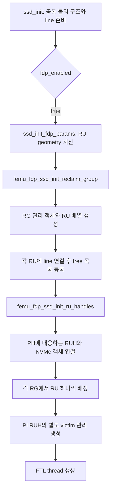

# 2단계 — FDP 초기화와 공간 구성

기준: `master`, 커밋 `e2d5413ff`. 현재 로컬 코드와 인용을 대조했다. 아래 수치 예시는 설명용이며 실험 결과가 아니다.

이전 자료: [1단계 — 객체 관계와 쓰기 포인터](01_FDP_objects_and_pointers.md) · 다음 자료: [3단계 — 배치 정보 해석](03_FDP_placement_resolution.md)

## 1. 이번 단원의 질문

**SSD 초기화가 끝났을 때, line·RU·RUH는 어떤 순서로 연결되고 실제로 할당 가능한 RU는 몇 개 남는가?**

1단계에서 본 객체들을 실제로 생성하는 순서로 따라간다. 핵심은 **RU를 구성하는 작업**과 **그 RU를 RUH의 현재 쓰기 공간으로 배정하는 작업**을 구분하는 것이다.



## 2. FDP 초기화 진입 조건과 선행 상태

출처: [bbssd/ftl.c:506–522](/root/workspace/FEMU/hw/femu/bbssd/ftl.c:506)

```c
    /* initialize all the lines */
    ssd_init_lines(ssd);

    /* FDP vs non-FDP init path */
    ssd->fdp_enabled = (n->subsys != NULL &&
                        n->subsys->params.fdp.enabled);
    ssd->fdp_debug = (getenv("FEMU_FDP_DEBUG") != NULL);

    if (ssd->fdp_enabled) {
        ssd_init_fdp_params(spp, n);

        ftl_log("FDP: initializing reclaim groups\n");
        femu_fdp_ssd_init_reclaim_group(n, ssd);
        ftl_log("FDP: initializing RU handles\n");
        femu_fdp_ssd_init_ru_handles(n, ssd);
        ftl_log("FDP: init complete (nrg=%lu, nruhs=%lu)\n",
                ssd->nrg, ssd->nruhs);
```

`ssd_init_lines()`가 먼저 끝나므로 FDP 초기화는 이미 생성된 line들을 사용할 수 있다. 활성화 조건은 subsystem이 존재하고 `subsys->params.fdp.enabled`가 참인 것이다. 여기서 설정한 `ssd->fdp_enabled`는 이후 쓰기 분기에도 쓰인다.

호출 순서는 `ssd_init_fdp_params()` → `femu_fdp_ssd_init_reclaim_group()` → `femu_fdp_ssd_init_ru_handles()`다. FTL thread 생성은 이 세 단계 뒤인 `ftl.c:528–529`에 있다.

`fdp_debug`는 환경변수의 **존재 여부**로 설정된다. 따라서 `FEMU_FDP_DEBUG=0`도 변수가 존재하면 이 식에서는 참이다. 개별 trace가 실제로 살아 있는지는 호출부까지 확인해야 한다.

**선행 조건:** 이 경로는 NVMe 측 `endgrp->fdp.rus`, `endgrp->fdp.ruhs`, namespace의 `fdp.phs`가 준비되어 있다고 기대한다. NVMe RU/RUH 배열 생성은 `femu.c:104–109`, PH 매핑 생성은 `femu.c:214–235`에서 확인할 수 있다. 여기서는 그 객체를 FTL 객체와 연결하는 부분에 집중한다.

## 3. geometry: RU 하나의 크기와 총수를 정한다

출처: [bbssd/ftl.c:2391–2409](/root/workspace/FEMU/hw/femu/bbssd/ftl.c:2391)

```c
    uint64_t runs = endgrp->fdp.runs;

    /* lines_per_ru: how many lines (superblocks) per reclaim unit */
    spp->lines_per_ru = 1; /* M1: 1 line per RU for simplicity */

    /*
     * Compute total RU count from device geometry:
     * total_ru = tt_lines / lines_per_ru
     * Clamp to endgrp->fdp.nru to avoid overflowing NvmeReclaimUnit array
     * allocated in nvme_subsys_setup_fdp().
     */
    spp->total_ru_cnt = spp->tt_lines / spp->lines_per_ru;

    if (endgrp->fdp.nru == 0) {
        endgrp->fdp.nru = spp->total_ru_cnt;
    } else if (spp->total_ru_cnt > (int)endgrp->fdp.nru) {
        ftl_log("FDP: clamping total_ru from %d to %lu (endgrp.nru)\n",
                spp->total_ru_cnt, (unsigned long)endgrp->fdp.nru);
        spp->total_ru_cnt = endgrp->fdp.nru;
```

실행문을 계산식으로 옮기면 다음과 같다.

- `lines_per_ru = 1`: 현재 구현은 RU마다 line 하나를 사용한다.
- 우선 `total_ru_cnt = tt_lines / lines_per_ru`로 계산한다.
- NVMe 측 `nru`가 0이면 그 필드에 계산값을 기록한다.
- NVMe 측 `nru`가 양수이며 계산값보다 작으면, FTL 측 `total_ru_cnt`를 그 값으로 줄인다.

여기서 `runs`를 읽지만 `lines_per_ru` 계산에 사용하지 않는다. 따라서 `fdp.runs`를 바꾸는 것과 FTL의 물리적인 RU 크기를 바꾸는 것을 동일하게 해석하면 안 된다. `runs`는 NVMe 측 `ruamw` 초기값 계산에도 쓰인다(`femu.c:223`); 그 단위와 실제 감소 방식은 통계 단원에서 다시 다룬다.

`nru == 0` 분기는 숫자 필드를 갱신할 뿐 이 함수 안에서 NVMe RU 배열을 새로 할당하지 않는다. 또한 앞선 NVMe 초기화는 `nruh > nru`를 거부한다(`femu.c:85–92`). 따라서 이 분기만 보고 `nru=0` 설정이 전체 초기화 경로에서 지원된다고 결론 내리면 안 된다.

## 4. RG 배열과 RU 관리 객체를 만든다

출처: [bbssd/ftl.c:2254–2272](/root/workspace/FEMU/hw/femu/bbssd/ftl.c:2254)

```c
    uint64_t rgs = subsys->params.fdp.nrg;
    FemuReclaimGroup *rg;
    uint64_t tt_nru = ssd->sp.total_ru_cnt;

    ftl_assert(tt_nru > 0);

    ssd->rg = g_malloc0(rgs * sizeof(FemuReclaimGroup));
    ssd->nrg = rgs;
    ssd->rus = g_malloc0(rgs * sizeof(FemuReclaimUnit *));

    for (int i = 0; i < (int)rgs; i++) {
        rg = &ssd->rg[i];
        rg->rgidx = i;
        rg->tt_nru = tt_nru / rgs;
        ssd->rus[i] = g_malloc0(tt_nru * sizeof(FemuReclaimUnit));
        rg->rus = ssd->rus[i];
        rg->ru_mgmt = g_malloc0(sizeof(struct ru_mgmt));
        femu_fdp_init_ru_mgmt(ssd, rg);
        fdp_log("Allocated %lu RUs to rg[%d]\n", tt_nru, i);
```

`tt_nru`는 앞 단계에서 계산한 **전체 FTL RU 수**다. 각 RG의 유효 RU 개수는 정수 나눗셈 `tt_nru / rgs`로 설정된다. `ssd->rus[i]`가 할당한 RU 배열을 `rg->rus`가 함께 가리킨다.

이 코드에서는 각 RG에 `tt_nru`개 분량의 메모리를 할당하지만, 뒤에서 실제 초기화하고 사용하는 개수는 `rg->tt_nru`개다. 따라서 로그의 `Allocated ... RUs`나 배열 할당 크기만 보고 RG의 유효 RU 수를 판단하면 안 된다.

나머지를 다른 RG에 배분하는 코드도 없으므로, 정상적인 양수 입력에서 초기화할 총 RU 수는 다음 식으로 읽는다.

```text
각 RG의 유효 RU 수 = floor(total_ru_cnt / nrg)
전체 초기화 RU 수 = nrg × floor(total_ru_cnt / nrg)
```

예를 들어 총 RU 수가 10이고 RG가 3이면 각 RG에 3개씩, 총 9개를 초기화한다. 이는 해당 반복문의 계산 예시이며, 다중 RG 전체 동작을 검증한 실험 결과는 아니다.

### 4.1 관리 객체의 기본 상태

출처: [bbssd/ftl.c:2182–2195](/root/workspace/FEMU/hw/femu/bbssd/ftl.c:2182)

```c
    rm->tt_rus = rg->tt_nru;
    rm->free_ru_cnt = rg->tt_nru;
    rm->victim_ru_cnt = 0;
    rm->full_ru_cnt = 0;
    rm->custom_gc_threshold = 0;

    /* default GC strategy */
    rm->mgmt_type = GC_GLOBAL_GREEDY;

    rm->is_gc_triggered = false;
    rm->is_force_gc_triggered = false;
    rm->waf_score_global = 0.0f;
    rm->waf_score_transitory = 0.0f;
    rm->utilization_overall = 0.0f;
```

처음에는 카운터상 모든 RU를 free로 두고 victim/full을 0으로 둔다. 이 시점은 초기화 도중이므로 실제 free 목록 등록이 아직 끝난 상태는 아니다. 뒤의 등록 반복문에서 `free_ru_cnt`를 다시 0으로 만들고 RU마다 증가시킨다.

`mgmt_type`의 초기값은 global greedy지만, RG 초기화 후반에 `n->bb_params.gc_strategy`로 덮어쓴다(`ftl.c:2307–2310`). 이 초기값 한 줄만 보고 최종 GC 전략을 판단하면 안 된다.

출처: [bbssd/ftl.c:2197–2207](/root/workspace/FEMU/hw/femu/bbssd/ftl.c:2197)

```c
    QTAILQ_INIT(&rm->free_ru_list);
    QTAILQ_INIT(&rm->full_ru_list);

    rm->victim_ru_pq = pqueue_init(rm->tt_rus, victim_ru_cmp_pri,
                                   victim_ru_get_pri, victim_ru_set_pri,
                                   victim_ru_get_pos, victim_ru_set_pos);

    rm->victim_ru_cb = pqueue_init(rm->tt_rus, victim_ru_cmp_pri_by_cb,
                                   victim_ru_get_pri_by_cb,
                                   victim_ru_set_pri_by_cb,
                                   victim_ru_get_pos, victim_ru_set_pos);
```

free/full 목록과 두 victim heap을 준비한다. 두 heap을 만들었다는 사실이 RU를 항상 양쪽에 동시에 등록한다는 뜻은 아니다. 실제 사용은 선택된 GC 전략과 삽입 경로에 달려 있다.

## 5. 각 RU를 NVMe 객체 및 line과 연결한다

출처: [bbssd/ftl.c:2275–2289](/root/workspace/FEMU/hw/femu/bbssd/ftl.c:2275)

```c
    /* link NvmeReclaimUnit pointers and init each SSD-level RU */
    NvmeReclaimUnit **russ = subsys->endgrp.fdp.rus;
    if (russ) {
        for (int i = 0; i < (int)rgs; i++) {
            rg = &ssd->rg[i];
            rg->ru_mgmt->free_ru_cnt = 0;
            for (int j = 0; j < rg->tt_nru; j++) {
                rg->rus[j].rgidx = i;
                rg->rus[j].nvme_ru = &russ[i][j];
                rg->rus[j].ruidx = j;
                femu_fdp_init_ssd_reclaim_unit(ssd, &rg->rus[j], i, j);
                QTAILQ_INSERT_TAIL(&rg->ru_mgmt->free_ru_list,
                                   &rg->rus[j], entry);
                rg->ru_mgmt->free_ru_cnt++;
            }
```

각 RU에 `(rgidx, ruidx)`를 기록하고, 동일 인덱스의 NVMe 측 RU를 `nvme_ru`로 연결한다. 이어서 물리 line과 write pointer를 구성한 뒤 RG의 free RU 목록에 넣는다.

이 블록은 `russ != NULL`일 때만 실행된다. 따라서 NVMe RU 배열이 없을 때도 앞서 만든 카운터만으로 초기화가 정상이라고 판단할 수 없다. 아래 설명은 선행 NVMe 초기화가 성공한 정상 경로를 전제로 한다.

### 5.1 RU 내부의 초기 상태

출처: [bbssd/ftl.c:2220–2227](/root/workspace/FEMU/hw/femu/bbssd/ftl.c:2220)

```c
    femu_ru->n_lines = spp->lines_per_ru;
    femu_ru->next_line_index = 1;
    femu_ru->vpc = 0;
    femu_ru->ipc = 0;
    femu_ru->pos = 0;
    femu_ru->ruh_pos = 0;     /* not yet in any victim pqueue */
    femu_ru->ssd_wptr = g_malloc0(sizeof(struct write_pointer));
    femu_ru->npages = spp->lines_per_ru * spp->pgs_per_line;
```

RU 내부에 write pointer 메모리를 만들고 `vpc`, `ipc`, heap 위치를 0으로 둔다. `npages`는 line 수와 line당 페이지 수의 곱이다. `next_line_index = 1`은 첫 line을 현재 line으로 사용하고 그 다음 인덱스를 준비하는 상태다.

출처: [bbssd/ftl.c:2230–2245](/root/workspace/FEMU/hw/femu/bbssd/ftl.c:2230)

```c
    femu_ru->lines = g_malloc0(femu_ru->n_lines * sizeof(struct line *));
    for (int i = 0; i < femu_ru->n_lines; i++) {
        femu_ru->lines[i] = get_next_free_line(ssd);
        if (!femu_ru->lines[i]) {
            ftl_err("FDP: no free line for RU %d (rg %d, line %d/%d)\n",
                    index, rgidx, i, femu_ru->n_lines);
            abort();
        }
        femu_ru->lines[i]->my_ru = femu_ru;
    }
    wpp->curline = femu_ru->lines[0];
    wpp->ch = 0;
    wpp->lun = 0;
    wpp->pl = 0;
    wpp->blk = wpp->curline->id;
    wpp->pg = 0;
```

기존 free line 목록에서 꺼낸 line을 RU에 고정적으로 연결하고, `line->my_ru`로 역방향 연결을 만든다. write pointer는 첫 line의 `(ch=0, lun=0, pg=0, pl=0)`에서 시작하며 `blk`는 그 line의 ID다.

**상태 변화의 의미:** line을 free line 목록에서 꺼냈다고 해서 호스트 데이터가 기록된 것은 아니다. 아직 쓰지 않은 line도 RU 구성에 배정되면서 line 목록에서 빠진다. `get_next_free_line()`의 감소는 `ftl.c:273–274`에서 확인된다. FDP에서 쓰기 공간 부족 여부를 볼 때는 RG의 `free_ru_cnt`를 읽어야 한다.

## 6. GC 임계값을 free RU 개수로 변환한다

출처: [bbssd/ftl.c:2290–2299](/root/workspace/FEMU/hw/femu/bbssd/ftl.c:2290)

```c
            rg->ru_mgmt->gc_thres_pcent =
                n->bb_params.gc_thres_pcent / 100.0;
            rg->ru_mgmt->gc_thres_pcent_high =
                n->bb_params.gc_thres_pcent_high / 100.0;
            rg->ru_mgmt->gc_thres_rus =
                (uint64_t)((1 - rg->ru_mgmt->gc_thres_pcent) *
                           rg->tt_nru);
            rg->ru_mgmt->gc_thres_rus_high =
                (uint64_t)((1 - rg->ru_mgmt->gc_thres_pcent_high) *
                           rg->tt_nru);
```

입력 퍼센트를 비율로 바꾼 뒤 그 보수에 RG의 RU 수를 곱한다. 코드상 비교는 다음과 같다.

출처: [bbssd/ftl.c:55–64](/root/workspace/FEMU/hw/femu/bbssd/ftl.c:55)

```c
static inline int16_t should_gc_fdp_style(struct ssd *ssd)
{
    for (int i = 0; i < (int)ssd->nrg; i++) {
        if (ssd->rg[i].ru_mgmt->free_ru_cnt <=
            ssd->rg[i].ru_mgmt->gc_thres_rus) {
            return i;
        }
    }
    return -1;
}
```

즉 일반 GC 판단은 `free_ru_cnt <= gc_thres_rus`다. 높은 임계값을 사용하는 판단도 동일하게 `free_ru_cnt <= gc_thres_rus_high`로 비교한다(`ftl.c:66–74`). 함수 반환값은 불리언이 아니라 **조건을 처음 만족한 RG 인덱스**, 또는 필요 없음을 뜻하는 `-1`이다.

가상 예시로 RG당 RU가 16개이고 입력이 일반 75%, high 88%라면 free 임계값은 각각 4, 1이다. high의 계산값은 `(1 - 0.88) × 16 = 1.92`이며 정수 형변환으로 1이 된다. RU 수가 적으면 이런 정수화의 영향이 크므로 실제 계산 결과를 확인해야 한다.

임계값은 공간 부족을 판단하는 기준이다. 어떤 victim을 고를지는 별도의 GC 전략에서 결정된다.

## 7. namespace의 PH에 대응하는 RUH를 초기화한다

출처: [bbssd/ftl.c:2320–2336](/root/workspace/FEMU/hw/femu/bbssd/ftl.c:2320)

```c
    NvmeNamespace *ns = &n->namespaces[0];
    NvmeSubsystem *subsys = n->subsys;
    NvmeEnduranceGroup *endgrp = &subsys->endgrp;
    uint16_t nruh = subsys->params.fdp.nruh;
    uint16_t ph, *ruhid;

    ssd->ruhs = g_malloc0(nruh * sizeof(FemuRuHandle));
    ssd->nruhs = nruh;
    ruhid = ns->fdp.phs;

    for (ph = 0; ph < ns->fdp.nphs; ph++, ruhid++) {
        uint16_t i = *ruhid;
        NvmeRuHandle *nvme_ruh = &endgrp->fdp.ruhs[i];

        ssd->ruhs[i].ruh = nvme_ruh;
        ssd->ruhs[i].ruh_type = nvme_ruh->ruht;
        ssd->ruhs[i].ruhid = i;
```

FTL RUH 배열은 `nruh` 크기로 만들지만, 초기화 반복문은 첫 namespace의 `nphs`와 `phs`를 따라간다. PH 번호를 그대로 인덱스로 사용하는 대신 `i = *ruhid`로 매핑 결과를 얻는다.

현재 namespace 초기화는 `nphs = nruh`, `phs[i] = i`를 설정한다(`femu.c:214–235`). 따라서 기본 생성 상태에서는 숫자가 같지만, 이 FTL 코드는 매핑 테이블을 통해 RUH를 선택하도록 작성되어 있다. PH와 RUH ID의 구분은 3단계에서 자세히 다룬다.

`ruh_type`도 FTL이 독립적으로 결정하는 것이 아니라 NVMe RUH의 `ruht`를 복사한다. 현재 NVMe 초기화 실행문은 다음과 같다.

출처: [femu.c:117–124](/root/workspace/FEMU/hw/femu/femu.c:117)

```c
        uint8_t ruht = NVME_RUHT_PERSISTENTLY_ISOLATED;
        if (subsys->params.fdp.isolation_mode &&
            ruhid == endgrp->fdp.nruh - 1) {
            ruht = NVME_RUHT_INITIALLY_ISOLATED;
        }
        endgrp->fdp.ruhs[ruhid] = (NvmeRuHandle) {
            .ruht = ruht,
            .ruha = NVME_RUHA_UNUSED,
```

기본적으로 PI이며, `isolation_mode`가 참이면 마지막 RUH만 II가 된다. 이를 모든 RUH가 II로 바뀌는 설정으로 해석하면 안 된다. 이는 이 checkout의 설정 처리다.

### 7.1 각 RUH에 RG마다 첫 RU를 배정한다

출처: [bbssd/ftl.c:2344–2352](/root/workspace/FEMU/hw/femu/bbssd/ftl.c:2344)

```c
        /* allocate per-RG RU pointer array */
        ssd->ruhs[i].rus = g_malloc0(sizeof(FemuReclaimUnit *) *
                                     endgrp->fdp.nrg);
        for (int j = 0; j < (int)endgrp->fdp.nrg; j++) {
            ssd->ruhs[i].rus[j] = fdp_get_new_ru(ssd, j, i);
            ssd->ruhs[i].rus[j]->ruh = &ssd->ruhs[i];
            ssd->ruhs[i].ruh->rus[j] = ssd->ruhs[i].rus[j]->nvme_ru;
            ssd->ruhs[i].curr_ru = ssd->ruhs[i].rus[j];
        }
```

각 RG마다 `fdp_get_new_ru()`로 RU 하나를 받는다. FTL의 `rus[j]`, NVMe 측 `ruh->rus[j]`, 단일 `curr_ru`가 연결된다.

할당 함수 안에서 실제로 중요한 상태 변화는 다음과 같다.

출처: [bbssd/ftl.c:1130–1144](/root/workspace/FEMU/hw/femu/bbssd/ftl.c:1130)

```c
    new_ru = get_next_free_ru(ssd, rg);
    if (!new_ru) {
        ftl_err("No reclaim unit available for ruh %d\n", ruhid);
        return NULL;
    }
    new_ru->rgidx = rgidx;
    new_ru->ruh = eruh;
    new_ru->last_init_time = qemu_clock_get_us(QEMU_CLOCK_REALTIME);
    new_ru->last_invalidated_time = 0;
    new_ru->erase_cnt = 0;
    new_ru->my_cb = 0.0f;
    new_ru->chance_token = 0;

    fdp_set_ru_write_pointer(ssd, new_ru);
    eruh->ru_in_use_cnt++;
```

`get_next_free_ru()`는 RG free 목록에서 RU를 빼고 `free_ru_cnt`를 줄인다(`ftl.c:1093–1100`). 그 RU에 RUH를 연결하고 쓰기 좌표를 초기화하며 `ru_in_use_cnt`를 늘린다.

따라서 **호스트 쓰기가 한 건도 없어도 RUH 초기화만으로 free RU가 감소한다.** 새로 배정된 RU는 비어 있지만 이미 특정 RUH의 활성 쓰기 공간이다.

실패 시 할당 함수는 `NULL`을 반환하지만 초기화 호출부는 바로 `rus[j]->ruh`를 역참조한다. 초기화할 RUH 수만큼 각 RG에 RU가 충분한지는 연구 설정을 바꿀 때 확인해야 하는 전제다. 이 자료에서는 수정 코드를 제시하지 않고 실행 조건을 표시한다.

### 7.2 PI 관리 객체 생성과 GC 공간 배정은 다르다

출처: [bbssd/ftl.c:2354–2362](/root/workspace/FEMU/hw/femu/bbssd/ftl.c:2354)

```c
        /* PI type RUHs get their own ru_mgmt for per-RUH victim queues */
        if (nvme_ruh->ruht == NVME_RUHT_PERSISTENTLY_ISOLATED) {
            ssd->ruhs[i].ru_mgmt = g_malloc0(sizeof(struct ru_mgmt));
            ssd->ruhs[i].ru_mgmt->mgmt_type = n->bb_params.gc_strategy;
            ssd->ruhs[i].ru_mgmt->victim_ru_cnt = 0;
            ssd->ruhs[i].ru_mgmt->full_ru_cnt = 0;
            ssd->ruhs[i].ru_mgmt->custom_gc_threshold = 0;
            QTAILQ_INIT(&ssd->ruhs[i].ru_mgmt->free_ru_list);
            QTAILQ_INIT(&ssd->ruhs[i].ru_mgmt->full_ru_list);
```

PI RUH에 별도 관리 메모리를 만들며, 이어지는 `ftl.c:2367–2375`에서 `ruh_pos`를 사용하는 heap을 만든다. 하지만 이 초기화 함수에는 `gc_ru`에 RU를 할당하는 대입이 없다. `g_malloc0()`로 만든 RUH의 `gc_ru`는 초기 상태에서 `NULL`이다.

PI의 GC 공간은 나중에 `check_gc_ruh_available()`에서 `gc_ru == NULL`일 때 `fdp_get_new_ru()`로 확보한다(`ftl.c:1481–1488`). 그러므로 RUH마다 호스트용과 GC용 RU 두 개가 부팅 때부터 배정된다고 계산하면 틀린다.

## 8. 초기화 전후를 숫자로 추적한다

**가상 예시:** `tt_lines=16`, `lines_per_ru=1`, NVMe `nru=16`, `nrg=1`, `nruh=nphs=3`, 서로 다른 RUH에 PH가 일대일로 대응하고 할당이 모두 성공한다고 둔다. RUH는 모두 PI다.

| 시점 | free line 수 | RG의 free RU 수 | 활성 호스트 RU 수 | PI GC RU 수 |
|---|---:|---:|---:|---:|
| 공통 line 초기화 완료 | 16 | 아직 구성 전 | 0 | 0 |
| RU 16개 구성 완료 | 0 | 16 | 0 | 0 |
| RUH 0에 첫 RU 배정 | 0 | 15 | 1 | 0 |
| RUH 1에 첫 RU 배정 | 0 | 14 | 2 | 0 |
| RUH 2에 첫 RU 배정 | 0 | 13 | 3 | 0 |

이때 full/victim RU는 모두 0이고, 페이지는 아직 기록되지 않았다. free line 수 0을 FDP의 공간 소진으로 해석하면 안 되는 이유가 표에 드러난다.

정상적인 일대일 PH 매핑과 할당 성공을 전제로, 각 RG의 초기 free RU 수는 다음과 같다.

```text
RG별 초기 free RU 수
  = floor(total_ru_cnt / nrg) - nphs
```

초기 호스트 RU 확보만 고려한 식이다. GC용 추가 여유 공간이나 GC 진행 가능성을 보장하는 조건은 아니다.

## 9. 연구 설정을 읽을 때의 확인 지점

| 코드상 사실 | 연구에서의 의미 |
|---|---|
| `lines_per_ru`는 1로 고정 | `runs` 변경만으로 FTL 물리 RU 크기가 바뀐다고 가정하지 않는다. |
| RG별 RU 수는 정수 나눗셈 | 총수의 나머지가 초기화 범위에서 제외될 수 있다. |
| NVMe `nru`와 FTL `rg->tt_nru`의 사용 방식이 다름 | 메모리 할당량·광고된 수치·실제 초기화 수를 구분한다. |
| RUH마다 각 RG에서 RU 하나씩 소비 | RUH 수를 늘리면 초기 free 공간도 달라진다. |
| `curr_ru`는 RG 반복문에서 계속 덮어씀 | 여러 RG를 실험하려면 요청 RG와 활성 포인터의 일치를 검증해야 한다. |
| 초기화가 `namespaces[0]`의 PH를 참조 | 여러 namespace로 확대할 때 초기화 가정을 별도로 점검한다. |

## 10. 확인 질문과 답

1. **RU 구성과 RUH 배정의 차이는?**  
   RU 구성은 line·write pointer·NVMe RU를 연결하고 free RU 목록에 넣는다. RUH 배정은 그 목록에서 RU를 꺼내 특정 RUH의 현재 쓰기 공간으로 지정한다.
2. **초기화 직후 `free_ru_cnt`가 총 RU 수보다 작은 이유는?**  
   RUH마다 첫 쓰기 RU를 이미 배정했기 때문이다.
3. **`gc_ru`도 초기화에서 배정되는가?**  
   현재 함수에서는 아니다. PI GC 공간 확보 함수에서 필요할 때 할당한다.
4. **global greedy가 항상 최종 정책인가?**  
   아니다. 관리 객체의 기본값이며, 뒤에서 `bb_params.gc_strategy`로 덮어쓴다.
5. **`free_line_cnt=0`이면 FDP 쓰기 공간도 없는가?**  
   아니다. line이 free RU를 구성하는 데 들어갔을 수 있다. RG의 free RU 수와 활성 RU의 잔여 공간을 구분한다.
6. **다중 RG에서 `curr_ru`는 초기화 후 어느 RU를 가리키는가?**  
   해당 RUH의 RG 반복문이 마지막으로 배정한 RU를 가리킨다. RG별 배열이 존재하는 것만으로 모든 쓰기 경로의 일관성을 보장하지는 않는다.

다음 단원에서는 준비된 RUH를 호스트 쓰기 요청의 PID가 어떻게 선택하는지 추적한다.
