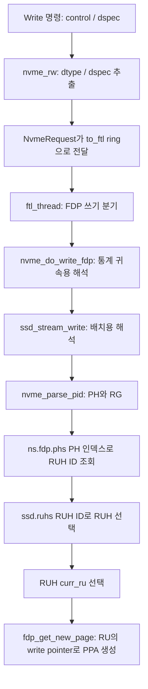

# 3단계 — 호스트 배치 정보에서 RG·RUH·RU 선택까지

기준: `master`, 커밋 `e2d5413ff`. 인용은 현재 로컬 코드의 발췌다. PID 예시는 실행 결과가 아닌 코드 계산 예시다.

이전 자료: [2단계 — 초기화와 공간 구성](02_FDP_initialization.md)

## 1. 이번 단원의 질문

**호스트가 쓰기에 넣은 배치 정보가 어떻게 `ssd->ruhs[ruhid]`와 실제 RU 선택으로 이어지는가?**

학습 순서는 명령 필드 → `NvmeRequest` → FTL 쓰기 분기 → PID 해석 → PH 매핑 → 활성 RU 선택이다. 실제 PPA 증가와 RU 교체는 다음 4단계의 주제다.

| 이름 | 이 경로에서의 의미 |
|---|---|
| DTYPE | 명령의 directive 종류. 코드의 `NVME_DIRECTIVE_DATA_PLACEMENT` 값은 `0x2` (`nvme.h:54`) |
| DSPEC | directive에 딸린 16비트 값. FDP 쓰기에서는 이 값을 PID로 해석 |
| PID | Placement Identifier. 해석 함수가 PH와 RG로 분리하는 입력 |
| PH | Placement Handle. namespace의 `phs[]` 배열을 조회하는 인덱스 |
| RG ID | FTL의 `ssd->rg[]` 선택에 사용하는 그룹 번호 |
| RUH ID | `ns->fdp.phs[ph]`로 얻어 `ssd->ruhs[]`를 선택하는 번호 |
| RU ID | 선택된 RU 객체의 `ruidx`. PID를 곧바로 물리 RU 번호로 쓰지 않음 |



## 2. 명령에서 DTYPE·DSPEC을 추출한다

`bb.c`의 `bb_io_cmd()`는 읽기·쓰기를 `bb_nvme_rw()`로 보내며, 이 함수는 `nvme_rw()`를 호출한다(`bb.c:81–95`). 배치 비트가 어디서 들어오는지 확인하기 위해 그 함수의 경계 부분만 본다.

출처: [nvme-io.c:522–533](/root/workspace/FEMU/hw/femu/nvme-io.c:522)

```c
    req->slba = slba;
    req->status = NVME_SUCCESS;
    req->nlb = nlb;

    /* FDP: extract placement info from write commands.
     * DTYPE is in CDW12 bits [23:20] = control bits [7:4] (fio: dtype<<20).
     * DSPEC is in CDW13 bits [31:16] = rw->dspec (fio: dspec<<16).
     */
    if (req->is_write && n->subsys && n->subsys->endgrp.fdp.enabled) {
        req->fdp_dspec = le16_to_cpu(rw->dspec);
        req->fdp_dtype = (le16_to_cpu(rw->control) >> 4) & 0xF;
    }
```

`rw->dspec`를 CPU 바이트 순서로 바꿔 `req->fdp_dspec`에 저장한다. `control`은 오른쪽으로 4비트 이동한 뒤 `0xF`로 마스킹하므로 bits [7:4]를 DTYPE으로 얻는다. 여기서는 명령에서 값을 추출할 뿐, 아직 그 값이 가리킬 RUH를 선택하지 않는다.

추출 조건은 쓰기이면서 subsystem이 존재하고 `endgrp->fdp.enabled`가 참인 것이다. FTL에서의 FDP 분기는 `ssd->fdp_enabled`를 보므로, 두 계층의 활성 상태를 혼동하지 않는다.

`req->nlb`는 원래 명령의 0-based NLB 값을 그대로 담은 것이 아니다. `nvme_rw()`가 `le16_to_cpu(rw->nlb) + 1`로 변환한 실제 LBA 개수다(`nvme-io.c:443–454`). 따라서 뒤에서 통계 바이트 수나 LPN 범위를 계산할 때 다시 1을 더하지 않는다.

이후 요청은 `to_ftl` ring에 들어간다(`nvme-io.c:198`). non-FDP에서 공부한 ring·poller 동작 자체는 여기서 반복하지 않는다.

## 3. FDP 경로 선택은 요청에 유효한 PID가 있는지와 별개다

출처: [bbssd/ftl.c:2562–2569](/root/workspace/FEMU/hw/femu/bbssd/ftl.c:2562)

```c
            switch (req->cmd.opcode) {
            case NVME_CMD_WRITE:
                if (ssd->fdp_enabled) {
                    lat = nvme_do_write_fdp(n, req, req->slba, req->nlb);
                } else {
                    lat = ssd_write(ssd, req);
                }
                break;
```

FTL은 SSD의 `fdp_enabled`로 `nvme_do_write_fdp()` 호출 여부를 결정한다. 따라서 FDP가 켜진 SSD에서 DTYPE이 배치 directive가 아니거나 PID가 잘못되어도, 이 지점에서 non-FDP 쓰기 함수로 되돌아가는 것은 아니다. FDP 쓰기 함수 안에서 기본 배치를 처리한다.

이 차이는 실험 해석에 중요하다. 배치 정보를 명시하지 않은 쓰기를 **FDP가 꺼진 장치의 쓰기**와 같은 실행 경로라고 취급하면 안 된다.

## 4. PID는 통계용과 실제 배치용으로 두 번 해석된다

### 4.1 먼저 요청 바이트 수를 누적한다

출처: [bbssd/ftl.c:2149–2152](/root/workspace/FEMU/hw/femu/bbssd/ftl.c:2149)

```c
    /* update FDP host bytes written stats */
    data_bytes = (uint64_t)nlb * spp->secsz;
    nvme_fdp_stat_inc(&ns->endgrp->fdp.hbmw, data_bytes);
    nvme_fdp_stat_inc(&ns->endgrp->fdp.mbmw, data_bytes);
```

이 함수는 `nlb * spp->secsz`를 계산해 endurance group의 두 카운터에 더한다. 코드가 이 위치에서 사용하는 단위는 FTL의 `secsz`다. 이를 실제 namespace LBA 크기와 일치하는지 확인하는 것은 설정 검증의 일부다.

통계 전체는 7단계에서 다루되, **증가 시점이 실제 페이지 배치보다 앞**이라는 사실은 지금 기억한다.

### 4.2 RUH별 통계에 귀속시키기 위해 PH를 해석한다

출처: [bbssd/ftl.c:2155–2170](/root/workspace/FEMU/hw/femu/bbssd/ftl.c:2155)

```c
    uint16_t pid = req->fdp_dspec;
    uint8_t dtype = req->fdp_dtype;
    uint16_t ph, rg, ruhid;

    if (dtype != NVME_DIRECTIVE_DATA_PLACEMENT ||
        !nvme_parse_pid(ns, pid, &ph, &rg)) {
        ph = 0;
        rg = 0;
    }
    ruhid = ns->fdp.phs[ph];
    nvme_fdp_stat_inc(&ssd->ruhs[ruhid].hbmw, data_bytes);
    nvme_fdp_stat_inc(&ssd->ruhs[ruhid].ruh->hbmw, data_bytes);
    nvme_fdp_stat_inc(&ssd->ruhs[ruhid].mbmw, data_bytes);
    nvme_fdp_stat_inc(&ssd->ruhs[ruhid].ruh->mbmw, data_bytes);

    return ssd_stream_write(n, ssd, req);
```

DTYPE이 배치 directive가 아니거나 PID 해석이 실패하면 `ph=0`, `rg=0`을 사용한다. 그 후 PH 매핑으로 RUH ID를 얻어 FTL/NVMe RUH의 통계를 갱신하고 `ssd_stream_write()`를 호출한다.

`ssd_stream_write()`도 요청에서 PID와 DTYPE을 다시 읽어 해석한다(`ftl.c:1998–2004`). 따라서 여기서 PH를 계산했다고 이후 함수에 PH가 인자로 전달되는 구조는 아니다.

두 곳의 정책을 변경하면 기본 배치 및 오류 처리의 일치 여부도 확인해야 한다. 특히 통계 함수에는 배치 함수의 RUH ID clamp와 동일한 검사가 없다는 점을 뒤에서 다시 짚는다.

## 5. `nvme_parse_pid()`는 어떤 값을 검사하는가?

출처: [nvme-io.c:816–823](/root/workspace/FEMU/hw/femu/nvme-io.c:816)

```c
bool nvme_parse_pid(NvmeNamespace *ns, uint16_t pid,
                    uint16_t *ph, uint16_t *rg)
{
    *rg = nvme_pid2rg(ns, pid);
    *ph = nvme_pid2ph(ns, pid);

    return nvme_ph_valid(ns, *ph) && nvme_rg_valid(ns->endgrp, *rg);
}
```

PID에서 RG와 PH를 추출한 다음 두 값의 범위를 확인한다. 범위 검사의 실제 조건은 다음과 같다.

출처: [nvme-io.c:794–802](/root/workspace/FEMU/hw/femu/nvme-io.c:794)

```c
static inline bool nvme_ph_valid(NvmeNamespace *ns, uint16_t ph)
{
    return ph < ns->fdp.nphs;
}

static inline bool nvme_rg_valid(NvmeEnduranceGroup *endgrp, uint16_t rg)
{
    return rg < endgrp->fdp.nrg;
}
```

검사하는 것은 `ph < nphs`, `rg < nrg`다. 이 함수 자체가 `ns->fdp.phs[ph]`의 **매핑 결과 RUH ID**까지 검사하는 것은 아니다. 함수 이름만으로 모든 배치 구조의 유효성이 확인되었다고 해석하면 안 된다.

### 5.1 RG가 하나인 일반 경로: `rgif == 0`

출처: [nvme-io.c:772–792](/root/workspace/FEMU/hw/femu/nvme-io.c:772)

```c
uint16_t nvme_pid2ph(NvmeNamespace *ns, uint16_t pid)
{
    uint16_t rgif = ns->endgrp->fdp.rgif;

    if (!rgif) {
        return pid;
    }

    return pid & ((1 << (15 - rgif)) - 1);
}

uint16_t nvme_pid2rg(NvmeNamespace *ns, uint16_t pid)
{
    uint16_t rgif = ns->endgrp->fdp.rgif;

    if (!rgif) {
        return 0;
    }

    return pid >> (16 - rgif);
}
```

`rgif == 0`이면 PH는 PID 전체이고 RG는 0이다. `femu.c:45–47`에서 `nrg == 1`일 때 `rgif=0`으로 설정하는 실행문을 확인할 수 있다.

예를 들어 `nphs=4`, `nrg=1`, `rgif=0`, PID=2라면 PH=2, RG=0이며 범위 검사를 통과한다. PID=4는 PH 범위 밖이므로 해석 실패다.

### 5.2 다중 RG 경로: 현재 비트 식을 그대로 읽는다

`rgif > 0`에서 이 checkout의 식은 다음과 같다.

```text
rg = pid >> (16 - rgif)
ph = pid & ((1 << (15 - rgif)) - 1)
```

RG는 상위 쪽을 사용하지만 PH 마스크는 `15 - rgif`비트다. 비교를 위해 PID 생성 함수도 읽는다.

출처: [nvme-io.c:804–814](/root/workspace/FEMU/hw/femu/nvme-io.c:804)

```c
static inline uint16_t nvme_make_pid(NvmeNamespace *ns, uint16_t rg,
                                     uint16_t ph)
{
    uint16_t rgif = ns->endgrp->fdp.rgif;

    if (!rgif) {
        return ph;
    }

    return (rg << (16 - rgif)) | ph;
}
```

생성식은 RG를 `16 - rgif`만큼 이동한다. 이 식과 PH 추출식을 비교하면 PH 추출이 bit `15 - rgif`를 버린다는 비대칭이 있다.

**코드 계산 예시:** `rgif=2`, `RG=1`, `PH=3`이라면 생성식은 PID `0x4003`을 만든다. 해석 결과는 RG=1, PH=3이다. 하지만 PID `0x6003`도 현재 추출식에서는 RG=1, PH=3이 된다. PH 마스크가 `0x1FFF`이므로 차이인 bit 13이 사라지기 때문이다.

이 예시는 두 PID가 같은 값으로 해석된다는 정적 계산이다. 어느 값이 규격상 허용되는지, 실제 설정에서 그 비트가 사용되는지, 운영 workload가 영향을 받는지는 별도의 확인 문제다. 본 단원은 현재 로컬 구현의 동작을 설명하며 FDP 규격 적합성 판정을 내리지 않는다.

## 6. DTYPE이 다르거나 PID 해석이 실패하면 어떻게 되는가?

진입 조건은 다음과 같다.

출처: [bbssd/ftl.c:1998–2004](/root/workspace/FEMU/hw/femu/bbssd/ftl.c:1998)

```c
    /* parse placement info from request */
    uint16_t pid = req->fdp_dspec;
    uint8_t dtype = req->fdp_dtype;
    uint16_t ph, rgid, ruhid;

    if (dtype != NVME_DIRECTIVE_DATA_PLACEMENT ||
        !nvme_parse_pid(ns, pid, &ph, &rgid)) {
```

C의 `||` 단락 평가 때문에 DTYPE이 배치 directive가 아니면 `nvme_parse_pid()`는 호출하지 않는다. 요청의 DSPEC에 어떤 숫자가 있어도 그 값으로 배치를 선택하지 않는다.

실패 블록 내부의 이벤트 처리는 다음과 같다.

출처: [bbssd/ftl.c:2005–2020](/root/workspace/FEMU/hw/femu/bbssd/ftl.c:2005)

```c
        /* generate INVALID_PID event if placement was attempted */
        if (dtype == NVME_DIRECTIVE_DATA_PLACEMENT && ssd->n->subsys) {
            NvmeEnduranceGroup *endgrp = &ssd->n->subsys->endgrp;
            NvmeRuHandle *def_ruh = &endgrp->fdp.ruhs[ns->fdp.phs[0]];
            if ((def_ruh->event_filter >>
                 nvme_fdp_evf_shifts[FDP_EVT_INVALID_PID]) & 0x1) {
                NvmeFdpEvent *e = ftl_fdp_alloc_event(ssd,
                                        &endgrp->fdp.host_events);
                e->type = FDP_EVT_INVALID_PID;
                e->flags = FDPEF_PIV | FDPEF_NSIDV;
                e->pid = cpu_to_le16(pid);
                e->nsid = cpu_to_le32(ns->id);
            }
        }
        ph = 0;
        rgid = 0;
```

세 가지를 구분한다.

1. **배치를 요청하지 않은 경우:** PH=0, RG=0을 사용하며 이 블록의 INVALID_PID 이벤트는 만들지 않는다.
2. **배치를 요청했지만 PID가 유효하지 않은 경우:** PH=0, RG=0으로 바꾸고, 기본 PH가 매핑한 RUH의 event filter가 허용하면 host event를 만든다.
3. **배치를 요청했고 PID가 유효한 경우:** 이 블록을 지나지 않고 해석된 PH와 RG를 사용한다.

이 함수의 실패 블록은 NVMe 오류를 반환해 쓰기를 즉시 거절하는 구조가 아니다. 이벤트 기록과 기본 배치 전환이 핵심 동작이다. 다른 선행 오류나 뒤의 공간 부족 문제까지 성공을 보장하는 뜻은 아니다.

## 7. PH에서 RUH ID로: 한 번의 간접 참조가 있다

출처: [bbssd/ftl.c:2023–2031](/root/workspace/FEMU/hw/femu/bbssd/ftl.c:2023)

```c
    ruhid = ns->fdp.phs[ph];
    /* safety: ruhid must be within bounds (nvme_parse_pid ensures ph is valid) */
    if (unlikely(ruhid >= (uint16_t)ssd->nruhs)) {
        ftl_err("ssd_stream_write: ruhid %u >= nruhs %lu, clamping to 0\n",
                (unsigned)ruhid, (unsigned long)ssd->nruhs);
        ruhid = 0;
    }
    rg = &ssd->rg[rgid];
    ruh = &ssd->ruhs[ruhid];
```

`ph`는 namespace의 `phs` 배열을 조회한다. 그 결과인 `ruhid`가 `ssd->ruhs[]`의 인덱스다. 현재 `femu.c:214–235`는 모든 RUH를 순서대로 namespace에 배정하고 `phs[i]=i`로 초기화한다. 기본 상태에서 PH와 RUH ID의 숫자가 같아도 역할은 다르다.

**매핑의 의미를 보여주기 위한 가상 예시:** `phs = [2, 0, 3, 1]`이라고 두면 PH=1은 RUH 0을, PH=0은 RUH 2를 선택한다. 이 표는 현재 초기화의 출력이 아니라 간접 참조를 설명하기 위한 가정이다.

따라서 기본 배치인 `ph=0`은 논리적으로 **PH 0에 매핑된 RUH**를 뜻한다. 무조건 RUH 0이라고 읽으면 안 된다. 반면 `ruhid >= ssd->nruhs`일 때의 clamp는 실제로 RUH ID 0을 대입하므로 다른 처리다.

### 7.1 clamp가 모든 상위 접근을 보호하는 것은 아니다

`ssd_stream_write()`에는 위 범위 검사가 있지만, 앞서 호출한 `nvme_do_write_fdp()`는 이미 `ssd->ruhs[ruhid]`로 통계를 갱신했다. 따라서 PH 매핑 자체가 잘못된 상황에서 이 clamp만으로 전체 경로가 안전하다고 주장할 수 없다.

정상 초기화가 만든 매핑을 읽는 기본 경로와, 매핑 테이블을 연구 목적으로 변경한 경로의 검증 조건을 구분해야 한다.

## 8. 선택된 RUH에서 현재 RU를 얻는다

현재 RU가 없을 때는 다음 코드가 새 RU 배정을 시도한다.

출처: [bbssd/ftl.c:2052–2065](/root/workspace/FEMU/hw/femu/bbssd/ftl.c:2052)

```c
            FemuReclaimUnit *fresh = fdp_get_new_ru(ssd, rgid, ruhid);
            if (fresh) {
                ruh->rus[rgid] = fresh;
                ruh->ruh->rus[rgid] = fresh->nvme_ru;
                ruh->curr_ru = fresh;
            }else{
                ftl_err("NO reclaim Unit. Device is full error\n");
                //Fallout
            }
        //}
        if (!ruh->curr_ru) {
            ftl_err("ssd_stream_write: no RU for ruh %d after GC\n", ruhid);
            return 0; /* return zero latency; write will be retried by GC */
        }
```

성공하면 FTL의 `rus[rgid]`, NVMe 측 `ruh->rus[rgid]`, `curr_ru`를 갱신한다. 실패해 `curr_ru`가 계속 없으면 지연값 0을 반환한다.

주변 `ftl.c:2037–2050`의 주석은 먼저 foreground GC를 실행한다고 설명하지만, 그 위치의 GC 반복문과 호출은 주석 처리되어 있다. 위 실행문은 먼저 free RU 할당을 시도한다. 별도의 foreground GC 반복문은 이 블록 **뒤** `ftl.c:2075–2088`에 있다.

또한 `return 0`의 주석에 재시도가 언급되어 있어도 이 블록에는 재시도 예약 동작이 없다. 호출자는 그 반환값을 지연으로 사용하며 FTL thread는 요청을 completion용 ring에 넣는다(`ftl.c:2585–2588`). 따라서 여기서는 **자동 재시도를 보장하는 근거가 없다**고 읽어야 한다. 앞서 통계가 증가했다는 사실도 실패 경로의 측정 해석에 영향을 준다.

정상 경로에서는 아래 참조를 사용한다.

출처: [bbssd/ftl.c:2067–2069](/root/workspace/FEMU/hw/femu/bbssd/ftl.c:2067)

```c
    ru = ruh->rus[rgid];
    ru = ruh->curr_ru;
    ftl_assert(ruh->curr_ru == ruh->rus[rgid]);
```

`ru = ruh->rus[rgid]` 직후 `ru = ruh->curr_ru`가 덮어쓴다. assertion은 두 포인터가 같아야 한다는 전제를 나타낸다. 2단계에서 본 단일 `curr_ru` 초기화와 연결하면, 다중 RG에서 요청이 선택한 RG와 실제 RU가 맞는지는 별도로 확인해야 한다.

## 9. 페이지 쓰기로 넘어가는 경계

페이지 반복문은 매번 다음과 같이 현재 RU를 다시 읽는다.

출처: [bbssd/ftl.c:2090–2105](/root/workspace/FEMU/hw/femu/bbssd/ftl.c:2090)

```c
    for (lpn = start_lpn; lpn <= end_lpn; lpn++) {
        /*
         * Updating curr_ru should be handled by fdp_advance_ru_pointer() naturally.
         */
        ru = ruh->curr_ru;

        ppa = get_maptbl_ent(ssd, lpn);
        if (mapped_ppa(&ppa)) {
            mark_page_invalid_fdp(ssd, &ppa);
            set_rmap_ent(ssd, INVALID_LPN, &ppa);
        }
        /* new write */
        ppa = fdp_get_new_page(ssd, ru);
        set_maptbl_ent(ssd, lpn, &ppa);
        set_rmap_ent(ssd, lpn, &ppa);
        mark_page_valid_fdp(ssd, &ppa, ru);
```

같은 요청이 여러 LPN에 걸치더라도 PH/RUH는 요청 단위로 선택되고, 페이지마다 `curr_ru`를 다시 읽는다. 따라서 RU를 다 채워 중간에 교체하면 같은 RUH의 다음 RU로 계속 쓰도록 연결된다. 교체와 공간 소진 시의 세부 처리는 4단계에서 확인한다.

덮어쓰기의 새 목적지는 이번 요청이 선택한 RUH다. 이전 PPA의 RUH가 새 배치를 강제하지 않는다. 기존 PPA는 무효화 경로에 전달되며, 그곳에서 기존 line/RU의 상태를 추적한다. 공통 매핑 동작은 반복하지 않고 이 FDP 배치 연결만 기억한다.

## 10. 요청 사례를 비교한다

**정상 상태를 전제로 한 가상 예시:** `nrg=1`, `rgif=0`, `nphs=4`, `phs=[0,1,2,3]`. 각 RUH의 현재 RU는 존재한다고 둔다.

| 요청 | 해석 또는 기본값 | 선택 결과 | INVALID_PID 이벤트 |
|---|---|---|---|
| DTYPE=2, PID=2 | PH=2, RG=0 | RUH 2의 `curr_ru` | 없음 |
| DTYPE=0, DSPEC=2 | 파싱을 생략하고 PH=0, RG=0 | RUH 0의 `curr_ru` | 없음 |
| DTYPE=2, PID=4 | PH 범위 검사 실패 후 PH=0, RG=0 | RUH 0의 `curr_ru` | event filter가 허용하면 기록 |
| 같은 LPN에 DTYPE=2, PID=1로 덮어쓰기 | PH=1, RG=0 | 새 페이지는 RUH 1의 `curr_ru` | 없음 |

가상 매핑 `phs=[2,0,3,1]`로 바꾸면 기본 PH=0의 목적지는 RUH 2가 된다. 유효한 PID=1은 RUH 0으로 간다. PID가 곧 물리 RU 번호이거나 언제나 RUH ID라는 해석을 피하기 위한 예시다.

## 11. 연구에서 이 경로가 갖는 의미

- **배치 효과를 확인할 때:** 호스트가 DTYPE과 DSPEC을 실제로 전달했고, FTL에서 기대한 PH/RUH로 해석했는지 먼저 확인한다. 이 함수가 데이터 내용을 분석해서 hot/cold를 자동 분류하는 것은 아니다.
- **기본 배치와 오류를 비교할 때:** 배치 미지정과 잘못된 PID는 같은 기본 배치를 사용할 수 있지만 이벤트 조건이 다르다.
- **다중 RG를 확장할 때:** PID 추출식뿐 아니라 `curr_ru`와 `rus[rgid]`의 일치도 확인한다.
- **통계를 읽을 때:** 통계 증가가 실제 배치보다 먼저이며, PH 매핑 검증과 실패 처리도 계층별로 다르다.

## 12. 확인 질문과 답

1. **PID=2이면 항상 RUH 2인가?**  
   아니다. 먼저 RG/PH로 해석하고 PH 매핑으로 RUH ID를 얻는다. 현재 단일 RG·identity 매핑의 초기 상태에서는 숫자가 일치할 수 있다.
2. **FDP 활성 SSD에 DTYPE=0으로 쓰면 non-FDP 함수가 실행되는가?**  
   아니다. FDP 쓰기 경로에서 PH=0, RG=0의 기본 배치를 사용한다.
3. **`nvme_parse_pid()`가 성공하면 RUH ID의 범위까지 확인된 것인가?**  
   아니다. PH와 RG 범위를 확인한다. PH 매핑 결과 RUH ID는 별개다.
4. **INVALID_PID 이벤트가 기록되면 쓰기를 무조건 거절하는가?**  
   이 블록에서는 기본 배치로 계속 진행한다. 이벤트와 명령 거절을 동일하게 읽지 않는다.
5. **통계용 해석 결과가 `ssd_stream_write()`의 인자로 전달되는가?**  
   아니다. 요청의 PID/DTYPE을 다시 읽고 해석한다.
6. **한 요청이 여러 RU를 사용할 수 있는가?**  
   페이지 반복 중 현재 RU가 소진되어 교체되면 가능하다. 요청이 선택한 RUH와 각 시점의 물리 RU를 구분한다.
7. **새 RU 할당 실패의 `return 0`은 성공적인 재시도 예약을 뜻하는가?**  
   아니다. 해당 실행문은 지연값 0을 반환할 뿐이며 이 위치에서 재시도를 예약하는 코드는 확인되지 않는다.

다음 4단계에서는 `fdp_get_new_page()`와 `fdp_advance_ru_pointer()`를 중심으로 PPA 진행, RU 소진, full/victim 등록, 새 RU 교체를 따라간다.
