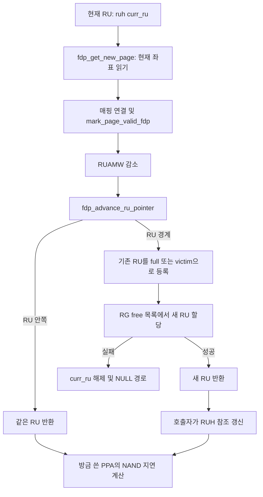

# 4단계 — 페이지 쓰기와 RU 교체

기준: `master`, 커밋 `e2d5413ff`. 현재 로컬 소스 기준이며 예시 geometry와 주소는 설명용이다.

이전: [3단계 — 배치 정보 해석](03_FDP_placement_resolution.md) · 다음: [5단계 — 무효화와 victim 관리](05_FDP_invalidation_and_queues.md)

## 1. 이번 단원의 질문

**RUH가 정해진 다음 어떤 PPA에 쓰고, RU가 가득 찼을 때 누가 새 RU를 배정하고 참조를 갱신하는가?**

3단계의 출력인 `rg`, `ruh`, `ruh->curr_ru`가 유효하게 준비된 정상 경로부터 시작한다. 기존 매핑·NAND 타이밍의 기초 대신 FDP의 공간 선택과 RU 경계를 본다.



## 2. 다음 페이지를 얻는 함수는 포인터를 진행시키지 않는다

출처: [bbssd/ftl.c:1158–1174](/root/workspace/FEMU/hw/femu/bbssd/ftl.c:1158)

```c
static struct ppa fdp_get_new_page(struct ssd *ssd, FemuReclaimUnit *ru)
{
    struct write_pointer *wpp = ru->ssd_wptr;
    struct ppa ppa;

    ftl_assert(ru != NULL);
    ftl_assert(wpp != NULL);

    ppa.ppa = 0;
    ppa.g.ch = wpp->ch;
    ppa.g.lun = wpp->lun;
    ppa.g.pg = wpp->pg;
    ppa.g.blk = wpp->blk;
    ppa.g.pl = wpp->pl;
    ftl_assert(ppa.g.pl == 0);

    return ppa;
```

`fdp_get_new_page()`는 해당 RU의 `ssd_wptr` 좌표를 PPA로 복사한다. 함수 이름의 “new page”는 이 시점에 free RU를 새로 배정한다는 뜻이 아니다. 좌표 증가도 여기서 하지 않는다.

따라서 한 페이지 쓰기는 **현재 PPA 읽기 → 그 페이지를 valid로 만들기 → 다음 좌표로 진행** 순서여야 한다. PPA만 여러 번 얻으면 같은 좌표를 반복해서 받는다.

`wpp`를 얻는 대입이 `ftl_assert(ru != NULL)`보다 앞에 있으므로, 이 assertion이 NULL 역참조를 예방한다고 해석해서도 안 된다. 정상 호출의 전제는 `ru`와 `ru->ssd_wptr`가 유효하다는 것이다.

## 3. 실제 호스트 페이지 쓰기의 FDP 연결

출처: [bbssd/ftl.c:2094–2110](/root/workspace/FEMU/hw/femu/bbssd/ftl.c:2094)

```c
        ru = ruh->curr_ru;

        ppa = get_maptbl_ent(ssd, lpn);
        if (mapped_ppa(&ppa)) {
            mark_page_invalid_fdp(ssd, &ppa);
            set_rmap_ent(ssd, INVALID_LPN, &ppa);
        }
        /* new write */
        ppa = fdp_get_new_page(ssd, ru);
        set_maptbl_ent(ssd, lpn, &ppa);
        set_rmap_ent(ssd, lpn, &ppa);
        mark_page_valid_fdp(ssd, &ppa, ru);

        /* decrement ruamw for this RU */
        if (ru->nvme_ru && ru->nvme_ru->ruamw > 0) {
            ru->nvme_ru->ruamw--; //TODO ? Does this really decrements page KiB?
        }
```

매 페이지마다 RUH의 `curr_ru`를 다시 읽는다. 기존 PPA가 있으면 그 PPA를 무효화한 뒤, 이번 요청이 선택한 RU에 새 페이지를 배치한다. 새 페이지가 valid가 된 후 NVMe RU의 `ruamw`를 1 줄인다.

이 감소는 **페이지 반복 한 번당 1**이다. `ruamw`가 0이어도 여기서 쓰기를 거절하거나 RU를 교체하지는 않는다. 실제 RU 경계는 아래 물리 좌표 진행에서 결정된다. 초기 단위와의 관계는 7단계에서 확인한다.

## 4. RU 안에서의 진행 순서: channel → LUN → page

출처: [bbssd/ftl.c:1194–1207](/root/workspace/FEMU/hw/femu/bbssd/ftl.c:1194)

```c
    check_addr(wpp->ch, spp->nchs);
    wpp->ch++;
    if (wpp->ch == spp->nchs) {
        wpp->ch = 0;
        check_addr(wpp->lun, spp->luns_per_ch);
        wpp->lun++;
        if (wpp->lun == spp->luns_per_ch) {
            wpp->lun = 0;
            check_addr(wpp->pg, spp->pgs_per_blk);
            wpp->pg++;
            if (wpp->pg == spp->pgs_per_blk) {
                //if (ru->next_line_index == ru->n_lines) { - TODO when ru 1->1..* mutliple lines
                wpp->pg = 0;
                ru_exhausted = true;
```

channel이 가장 먼저 증가한다. channel을 모두 돌면 LUN을 증가시키고, LUN까지 모두 돌면 page offset을 증가시킨다. `pgs_per_blk`까지 도달하면 `pg`를 0으로 만들고 RU 소진을 표시한다.

**가상 geometry:** channel 2개, channel당 LUN 2개, block당 페이지 2개, RU당 line 1개라고 두면 RU에는 8페이지가 있다. 현재 line ID가 5라면 주소 순서는 다음과 같다. plane은 계속 0이다.

| 페이지 쓰기 순서 | 쓰기 전 `(ch, lun, pg, blk)` | 쓰기 후 진행 |
|---:|---|---|
| 1 | `(0,0,0,5)` | channel 1 |
| 2 | `(1,0,0,5)` | channel 0, LUN 1 |
| 3 | `(0,1,0,5)` | channel 1 |
| 4 | `(1,1,0,5)` | channel 0, LUN 0, page 1 |
| 5 | `(0,0,1,5)` | channel 1 |
| 6 | `(1,0,1,5)` | channel 0, LUN 1 |
| 7 | `(0,1,1,5)` | channel 1 |
| 8 | `(1,1,1,5)` | RU 소진, 새 RU 배정 시도 |

RU를 교체할 때 다음 block ID를 단순히 `blk++`로 얻지 않는다. free 목록에서 선택된 RU의 첫 line ID로 바뀐다.

### 다중 line 자료구조와 실제 진행 코드의 차이

`ftl.c:1205`의 다중 line 경계 조건은 주석 처리되어 있다. 현재 진행 함수에는 다음 line을 `curline`으로 바꾸는 동작이 없고 첫 line의 페이지 진행이 끝나면 RU 소진으로 처리한다. 따라서 `lines_per_ru` 값만 2 이상으로 바꾸는 것으로 다중 line RU 지원이 완성되지 않는다. 현재 정상 설명은 초기화의 `lines_per_ru=1`을 전제로 한다.

## 5. 다 쓴 RU는 full인가, victim인가?

출처: [bbssd/ftl.c:1209–1224](/root/workspace/FEMU/hw/femu/bbssd/ftl.c:1209)

```c
                for (int i = 0; i < ru->n_lines; i++) {
                    struct line *line = ru->lines[i];
                    if (line->vpc != spp->pgs_per_line) {
                        is_full = false;
                    }
                }

                /* update RU vpc from its lines */
                ru->vpc = 0;
                for (int i = 0; i < ru->n_lines; i++) {
                    ru->vpc += ru->lines[i]->vpc;
                }

                if (is_full) {
                    QTAILQ_INSERT_TAIL(&rm->full_ru_list, ru, entry);
                    rm->full_ru_cnt++;
```

모든 line의 `vpc`가 `pgs_per_line`과 같으면 모든 페이지가 유효하므로 full 목록에 넣는다. RU 공간이 다 쓰였다는 사실과, 그 데이터가 모두 유효하다는 사실은 별개다.

출처: [bbssd/ftl.c:1225–1238](/root/workspace/FEMU/hw/femu/bbssd/ftl.c:1225)

```c
                } else {
                    ru->utilization = (float)ru->vpc / ru->npages;
                    if (rm->mgmt_type == GC_GLOBAL_CB){ 
                        if (ru->utilization < 1.0f && ru->last_invalidated_time > 0) {
                        ru->my_cb = (uint64_t)(100000.0f * ru->utilization /
                            ((1.0f - ru->utilization + 0.001f) *
                            (float)ru->last_invalidated_time));
                        }
                        pqueue_insert(rm->victim_ru_cb, ru);
                    }else{
                        pqueue_insert(rm->victim_ru_pq, ru);
                        //TODO per ruh victim queue - experimental
                    }
                    rm->victim_ru_cnt++;
```

RU를 쓰는 동안 같은 LPN을 덮어썼다면 이미 무효 페이지가 생길 수 있다. 이때는 RU 소진 시 full을 거치지 않고 victim heap에 넣는다. CB 전략이면 `victim_ru_cb`, 그 외는 이 지점에서 `victim_ru_pq`를 사용한다.

**예시:** 용량 8페이지인 RU가 순서대로 `A,B,A,C,D,E,F,G`를 받았다면 공간은 모두 썼지만 첫 번째 A는 무효다. 결과는 `vpc=7`, `ipc=1`인 victim RU다. 8개의 서로 다른 LPN을 썼다면 `vpc=8`, `ipc=0`인 full RU다.

이 함수의 victim 등록에는 per-RUH queue로 복제하는 실행문이 없다(`ftl.c:1236`은 TODO 주석). 5단계의 full→victim 경로와 비교하면 NOISY 정책이 보는 RUH별 후보 집합에 차이가 생길 수 있다.

## 6. 새 RU의 할당과 상태 초기화

RU 경계에서는 `fdp_get_new_ru(ssd, ru->rgidx, ruh->ruhid)`를 호출한다(`ftl.c:1244`). 기존 RU와 같은 RG에서 같은 RUH를 위한 공간을 찾는다.

출처: [bbssd/ftl.c:1093–1101](/root/workspace/FEMU/hw/femu/bbssd/ftl.c:1093)

```c
    ru = QTAILQ_FIRST(&rm->free_ru_list);
    if (!ru) {
        ftl_err("No free RUs left in rg[%d]\n", rg->rgidx);
        return NULL;
    }

    QTAILQ_REMOVE(&rm->free_ru_list, ru, entry);
    rm->free_ru_cnt--;
    return ru;
```

RG의 free 목록 첫 RU를 꺼내고 카운터를 감소시킨다. 이 함수 안에 RUH별 독립 free pool 선택이나 데이터 내용 기반 선택은 없다.

출처: [bbssd/ftl.c:1135–1148](/root/workspace/FEMU/hw/femu/bbssd/ftl.c:1135)

```c
    new_ru->rgidx = rgidx;
    new_ru->ruh = eruh;
    new_ru->last_init_time = qemu_clock_get_us(QEMU_CLOCK_REALTIME);
    new_ru->last_invalidated_time = 0;
    new_ru->erase_cnt = 0;
    new_ru->my_cb = 0.0f;
    new_ru->chance_token = 0;

    fdp_set_ru_write_pointer(ssd, new_ru);
    eruh->ru_in_use_cnt++;

    /* update NvmeRuHandle to reflect the new active RU's ruamw */
    if (eruh->ruh && eruh->ruh->rus) {
        eruh->ruh->rus[rgidx] = new_ru->nvme_ru;
```

배정된 RU에 RUH를 연결하고 쓰기 좌표를 첫 line 시작으로 초기화한다. `ru_in_use_cnt`가 증가하며 NVMe RUH의 RG별 포인터도 새 RU를 가리킨다.

주의할 점은 이 함수가 FTL `eruh->curr_ru`와 `eruh->rus[rgidx]`를 모두 갱신하는 함수는 아니라는 것이다. 그 갱신은 호출 경로에 남아 있다.

## 7. 반환값과 호출자의 책임

출처: [bbssd/ftl.c:1281–1288](/root/workspace/FEMU/hw/femu/bbssd/ftl.c:1281)

```c
    if (new_ru != NULL) {
        return new_ru;
    }
    if (ru_exhausted) {
        /* RU is now in full_ru_list/victim_pq; signal caller via NULL */
        return NULL;
    }
    return ru;
```

| 반환값 | 의미 | 호스트 쓰기 호출자가 할 일 |
|---|---|---|
| 입력과 같은 RU | 아직 RU 안쪽 | 기존 참조 유지 |
| 다른 RU 포인터 | RU 소진 후 새 RU 확보 | 현재 RU 참조를 새 RU로 연결 |
| `NULL` | RU 소진 후 후속 RU가 없음 등 | 정상 페이지 배치를 계속할 수 없는 경로 |

호스트 호출자의 실제 갱신은 다음과 같다.

출처: [bbssd/ftl.c:2112–2125](/root/workspace/FEMU/hw/femu/bbssd/ftl.c:2112)

```c
        /* advance RU write pointer; may allocate new RU */
        FemuReclaimUnit *ret = fdp_advance_ru_pointer(ssd, rg, ruh, ru);
        if (ret && ret != ruh->curr_ru) {
            ruh->rus[rgid] = ret;
            ruh->curr_ru = ret;
            ruh->ruh->rus[rgid] = ret->nvme_ru;
            ru = ret;
        } else if (!ret) {
            /*
             * fdp_advance_ru_pointer cleared curr_ru (no free RU).
             * The while loop at the top of next iteration will handle it.
             */
            ru = NULL;
        }
```

성공하면 FTL의 `rus[rgid]`, `curr_ru`, NVMe 측 `ruh->rus[rgid]`를 새 RU로 맞춘다. 다음 페이지 반복은 갱신된 `curr_ru`를 읽는다. 반면 GC 호출자는 PI/II에 따라 갱신 대상을 다르게 선택한다. 그 분기는 6단계에서 본다.

`ruh == NULL`로 호출된 채 RU 경계를 넘으면 새 RU 할당 블록을 생략하므로 `ru_exhausted` 경로에서 NULL을 반환한다. 함수의 반환 규칙과 실제 호출부의 인자 조건을 함께 읽어야 한다.

## 8. 마지막 페이지를 쓰면 즉시 후속 RU를 확보한다

이 함수는 “다음 호스트 요청이 도착하면 할당”하는 방식이 아니다. 마지막 페이지를 valid로 만든 직후 포인터 진행 중 새 RU를 미리 확보한다.

**상태 예시:** free RU가 3개일 때 활성 RU 2의 마지막 페이지를 쓰고 새 RU 7을 받으면, free는 2가 되고 RU 2는 full/victim으로 이동하며 `curr_ru`는 비어 있는 RU 7이 된다. 추가 호스트 데이터가 없어도 활성 RU 하나가 확보된 상태다.

이 동작은 RUH 수에 따른 초기 공간 소모와 함께 free RU 압력에 영향을 준다. 또한 GC 목적 RU가 마지막 페이지까지 찬 경우에도 공통 진행 함수가 새 RU를 시도하므로, “이번 GC의 복사가 끝났으니 후속 공간은 필요 없다”는 판단과 코드 동작이 다를 수 있다.

## 9. 공간 소진 시 주석과 실행문을 구분한다

출처: [bbssd/ftl.c:1244–1255](/root/workspace/FEMU/hw/femu/bbssd/ftl.c:1244)

```c
                    new_ru = fdp_get_new_ru(ssd, ru->rgidx, ruh->ruhid);
                    if (!new_ru) {
                        ftl_err("No free RU for ruh %d: device full - point %s L:%d\n",
                                ruh->ruhid, __FILE__, __LINE__);
                        /*
                         * Signal device pressure: clear curr_ru so
                         * callers know no active write frontier exists.
                         */
                        ruh->curr_ru = NULL;
                        ftl_assert(false && __LINE__ );
                        /* TODO */
                        return NULL;
```

할당 실패 시 `curr_ru=NULL`을 기록하고 assertion 및 NULL 반환으로 이어진다. 하지만 assertion의 실제 실행 여부는 매크로에 달려 있다.

출처: [bbssd/ftl.h:344–349](/root/workspace/FEMU/hw/femu/bbssd/ftl.h:344)

```c
/* FEMU assert() */
#ifdef FEMU_DEBUG_FTL
#define ftl_assert(expression) assert(expression)
#else
#define ftl_assert(expression)
#endif
```

`FEMU_DEBUG_FTL`이 정의되지 않으면 `ftl_assert`는 빈 매크로다. 환경변수 `FEMU_FDP_DEBUG`는 trace를 제어하는 별도 기능이므로 assertion을 켜지 않는다. 실제 빌드 플래그를 확인하지 않고 중단 여부를 단정하지 않는다.

호스트 루프의 `else if (!ret)` 주석은 다음 반복 상단에서 처리한다고 말하지만, 루프 안에는 `curr_ru==NULL`일 때 복구하는 분기가 없다. 3단계에서 본 복구 시도는 페이지 루프 **앞**에 한 번 있다. 따라서 같은 요청에 페이지가 더 남으면 다음 반복에서 NULL RU로 페이지 할당에 접근할 수 있다. 이는 소스에서 확인한 실패 경로상의 위험이며, 이 문서를 위해 실제 장치를 소진시키는 실험을 실행한 것은 아니다.

## 10. 지연 계산이 사용하는 PPA는 방금 쓴 페이지다

출처: [bbssd/ftl.c:2127–2135](/root/workspace/FEMU/hw/femu/bbssd/ftl.c:2127)

```c
        struct nand_cmd swr;
        swr.type = USER_IO;
        swr.cmd = NAND_WRITE;
        swr.stime = req->stime;
        curlat = ssd_advance_status(ssd, &ppa, &swr);
        maxlat = (curlat > maxlat) ? curlat : maxlat;
    }

    return maxlat;
```

RU 교체 후에도 `ppa`에는 방금 기록한 페이지 주소가 남아 있다. 이 주소의 NAND write 지연을 계산하고 요청 안에서 최댓값을 반환한다. 새 RU의 시작 PPA로 마지막 페이지의 지연을 잘못 계산하는 구조는 아니다.

다만 free RU 확보 실패나 일부 페이지만 처리한 요청의 성공/실패 의미는 별개이며, 단순히 반환 지연이 있다는 사실로 전체 쓰기 성공을 추론하면 안 된다.

## 11. 확인 질문과 답

1. **`fdp_get_new_page()` 두 번 호출하면 다음 두 페이지를 얻는가?**  
   아니다. 사이에 포인터 진행이 없다면 같은 PPA를 얻는다.
2. **물리 공간을 다 쓴 RU는 항상 full 목록에 들어가는가?**  
   모든 페이지가 valid일 때만 그렇다. 이미 무효 페이지가 있으면 victim으로 들어간다.
3. **새 RU의 line ID는 이전 ID+1인가?**  
   보장되지 않는다. RG free 목록에서 꺼낸 RU가 가진 line ID다.
4. **누가 호스트 쓰기의 `curr_ru`를 갱신하는가?**  
   정상 교체 시 `ssd_stream_write()` 호출부가 반환된 새 RU로 갱신한다. 할당 함수는 NVMe 측 참조 등 일부 상태를 먼저 바꾼다.
5. **`ruamw==0`이 RU 교체 조건인가?**  
   이 쓰기 경로의 교체 조건은 물리 write pointer의 경계다.
6. **`lines_per_ru`만 늘리면 되는가?**  
   아니다. 현재 포인터 진행의 다중 line 전환이 구현되어 있지 않다.
7. **FDP trace를 켜면 `ftl_assert`도 실행되는가?**  
   아니다. 전자는 런타임 환경변수, 후자는 컴파일 시 매크로 정의에 의해 제어된다.
