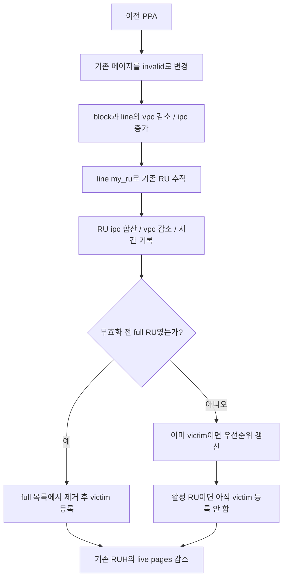

# 5단계 — 무효화, RU 통계, victim queue

기준: `master`, 커밋 `e2d5413ff`. 코드 동작과 정적 검토상의 확인 지점을 구분한다. 수치 예시는 설명용이다.

이전: [4단계 — 쓰기와 RU 교체](04_FDP_write_and_RU_rotation.md) · 다음: [6단계 — GC와 격리](06_FDP_GC_and_isolation.md)

## 1. 이번 단원의 질문

**한 페이지의 덮어쓰기가 기존 RU의 상태, RUH의 유효 데이터 수, GC 후보 순서에 어떻게 전파되는가?**

FDP에서 중요한 추가 연결은 `기존 PPA → line → my_ru → ruh`다. 새 페이지의 배치 대상과 이전 페이지의 소속 RUH가 다를 수 있으므로, 이전 상태를 새 배치의 RUH에서 차감하면 안 된다.



## 2. 새 페이지를 valid로 만들 때 RU와 RUH도 갱신된다

출처: [bbssd/ftl.c:1309–1324](/root/workspace/FEMU/hw/femu/bbssd/ftl.c:1309)

```c
    line = get_line(ssd, ppa);
    ftl_assert(line->vpc >= 0 && line->vpc < ssd->sp.pgs_per_line);
    line->vpc++;

    /* update RU vpc from its line (single-line RU fast path) */
    ftl_assert(line->my_ru == ru);
    if (ru->n_lines == 1) {
        ru->vpc = line->vpc;
    } else {
        ru->vpc = 0;
        for (int i = 0; i < ru->n_lines; i++) {
            ru->vpc += ru->lines[i]->vpc;
        }
    }

    ru->ruh->ruh_live_pages_cnt++;
```

공통 page/block 갱신 뒤 line의 `vpc`를 늘리고, RU의 `vpc`를 line의 합으로 맞춘다. 현재 한 line RU에서는 그대로 복사한다. 마지막으로 소유 RUH의 `ruh_live_pages_cnt`를 증가시킨다.

`line->my_ru == ru`는 “선택한 RU의 물리 line에 실제로 기록했는가”라는 불변조건을 표현한다. 4단계에서 확인했듯 assertion이 실제 실행되는지는 컴파일 설정에 달려 있다.

이 함수는 `ru_in_use_cnt`를 늘리지 않는다. 페이지 수와 배정 RU 수는 서로 다른 카운터다.

## 3. 무효화의 출발점과 중복 호출 처리

출처: [bbssd/ftl.c:1340–1351](/root/workspace/FEMU/hw/femu/bbssd/ftl.c:1340)

```c
    pg = get_pg(ssd, ppa);
    if (pg->status == PG_INVALID) {
        return;  /* already invalidated */
    }
    ftl_assert(pg->status == PG_VALID);
    pg->status = PG_INVALID;

    blk = get_blk(ssd, ppa);
    ftl_assert(blk->ipc >= 0 && blk->ipc < spp->pgs_per_blk);
    blk->ipc++;
    ftl_assert(blk->vpc > 0 && blk->vpc <= spp->pgs_per_blk);
    blk->vpc--;
```

이미 invalid인 페이지면 즉시 반환한다. 같은 페이지를 다시 invalid로 처리하면서 카운터를 중복 차감하는 것을 막는다. free 페이지는 정상 입력으로 기대하지 않으며 assertion은 valid 상태를 요구한다.

그 다음 line에서 같은 변화를 반영한다.

출처: [bbssd/ftl.c:1353–1370](/root/workspace/FEMU/hw/femu/bbssd/ftl.c:1353)

```c
    line = get_line(ssd, ppa);
    ftl_assert(line->ipc >= 0 && line->ipc < spp->pgs_per_line);
    if (line->vpc == spp->pgs_per_line) {
        ftl_assert(line->ipc == 0);
    }
    line->ipc++;
    ftl_assert(line->vpc > 0 && line->vpc <= spp->pgs_per_line);
    line->vpc--;

    /* update RU state */
    ru = line->my_ru;
    ftl_assert(ru != NULL);
    rm = ssd->rg[ru->rgidx].ru_mgmt;
    /* aggregate ipc across all lines in this RU (n_lines=1 in typical config) */
    ru->ipc = 0;
    for (int li = 0; li < ru->n_lines; li++) {
        ru->ipc += ru->lines[li]->ipc;
    }
```

`line->my_ru`를 통해 기존 RU를 얻고, `ru->rgidx`로 그 RU의 RG 관리 객체를 찾는다. 입력 요청이 새로 선택한 RG/RUH를 따라가지 않는다. `ipc`는 모든 소속 line의 합으로 다시 계산한다.

## 4. `was_full_ru`는 감소 전 RU vpc를 읽는다

출처: [bbssd/ftl.c:1380–1389](/root/workspace/FEMU/hw/femu/bbssd/ftl.c:1380)

```c
    /* check if RU was full and needs to move to victim */
    if (ru->vpc == spp->pgs_per_line * ru->n_lines) {
        was_full_ru = true;
    }

    /* update RU vpc and victim queue priority based on GC strategy */
    ru->vpc--;
    ru->utilization = (ru->vpc + ru->ipc > 0) ?
        (float)ru->vpc / (ru->vpc + ru->ipc) : 0.0f;
    ru->last_invalidated_time = qemu_clock_get_us(QEMU_CLOCK_REALTIME);
```

이 시점에는 line의 `vpc`는 이미 줄었지만 RU의 `vpc`는 아직 줄기 전이다. 따라서 이전 RU가 전체 용량만큼 유효 페이지를 가졌는지 검사할 수 있다. 검사 뒤 `ru->vpc--`를 수행한다.

**가상 예시:** 8페이지 RU가 `vpc=8, ipc=0`인 full 상태일 때 한 페이지를 덮어쓰면:

| 순서 | line 상태 | RU 상태 |
|---|---|---|
| 진입 | `(vpc=8, ipc=0)` | `(8,0)` |
| line 갱신 후 | `(7,1)` | `vpc`는 아직 8 |
| RU ipc 합산 후 | `(7,1)` | `(8,1)` |
| `was_full_ru` 판단 | 동일 | 8이 용량과 같으므로 true |
| RU vpc 감소 후 | 동일 | `(7,1)` |

함수 중간의 일시 상태와 함수가 끝난 시점의 불변조건을 구분해야 한다.

### utilization의 분모를 확인한다

여기서 utilization은 `vpc / (vpc + ipc)`다. 아직 빈 페이지가 있는 활성 RU라면 전체 RU 용량 대비 사용률이 아니라 **이미 쓴 페이지 중 유효한 비율**이다. 닫힌 RU에서는 `vpc+ipc=npages`이므로 전체 용량 대비 유효 비율과 같아진다.

예를 들어 용량 8페이지인 활성 RU에서 3번 기록 후 1개가 무효라면 `vpc=2, ipc=1`이어서 utilization은 `2/3`이다. `2/8`이 아니다. RU 소진 시에는 `vpc/npages`를 사용한다(`ftl.c:1226`). 두 식이 쓰이는 시점을 구분한다.

## 5. full에서 victim으로 이동하는 경로

출처: [bbssd/ftl.c:1391–1397](/root/workspace/FEMU/hw/femu/bbssd/ftl.c:1391)

```c
    switch (rm->mgmt_type) {
    case GC_GLOBAL_GREEDY:
    case GC_GLOBAL_RAND:
    case GC_NOISY_RUH_CUSTOM:
        if (ru->pos) {
            pqueue_change_priority(rm->victim_ru_pq, ru->vpc, ru);
        }
```

이미 victim heap에 있으면 `ru->pos`가 그 heap 내부 위치를 나타내며 우선순위 갱신을 요청한다. 아직 활성 RU인 경우는 일반적으로 `pos=0`이므로 여기서 heap에 들어가지 않는다.

출처: [bbssd/ftl.c:1409–1424](/root/workspace/FEMU/hw/femu/bbssd/ftl.c:1409)

```c
        if (was_full_ru) {
            QTAILQ_REMOVE(&rm->full_ru_list, ru, entry);
            rm->full_ru_cnt--;
            pqueue_insert(rm->victim_ru_pq, ru);
            rm->victim_ru_cnt++;
            /*
             * Mirror into the per-RUH queue ONLY for the strategy that reads it
             * (GC_NOISY_RUH_CUSTOM). GREEDY/RAND never pop the per-RUH queue, so
             * a second membership there would just go stale on the global pop
             * and later corrupt that heap (issue #189).
             */
            if (rm->mgmt_type == GC_NOISY_RUH_CUSTOM &&
                ru->ruh && ru->ruh->ru_mgmt) {
               pqueue_insert(ru->ruh->ru_mgmt->victim_ru_pq, ru);
               ru->ruh->ru_mgmt->victim_ru_cnt++;
            }
```

full RU의 첫 무효화이면 full 목록에서 제거하고 global victim heap에 넣는다. NOISY 정책이면서 해당 RUH의 관리 객체가 존재할 때는 RUH별 heap에도 넣는다.

**닫히기 전 무효화와 닫힌 후 무효화의 차이:**

| 무효화 시점 | 그 자리에서 victim 등록? | 뒤의 경로 |
|---|---|---|
| 아직 쓰는 활성 RU | 아니오 | RU를 다 쓰면 4단계의 경계 처리에서 등록 |
| 모두 valid인 full RU | 예 | full→victim 이동 |
| 이미 victim인 RU | 새 등록이 아니라 우선순위 갱신 | heap 위치·카운터의 일관성 유지 필요 |

## 6. global heap과 RUH heap의 위치는 다르다

출처: [bbssd/ftl.c:160–168](/root/workspace/FEMU/hw/femu/bbssd/ftl.c:160)

```c
static inline size_t victim_ru_get_pos(void *a)
{
    return ((FemuReclaimUnit *)a)->pos;
}

static inline void victim_ru_set_pos(void *a, size_t pos)
{
    ((FemuReclaimUnit *)a)->pos = pos;
}
```

출처: [bbssd/ftl.c:178–185](/root/workspace/FEMU/hw/femu/bbssd/ftl.c:178)

```c
static inline size_t victim_ru_get_pos_ruh(void *a)
{
    return ((FemuReclaimUnit *)a)->ruh_pos;
}

static inline void victim_ru_set_pos_ruh(void *a, size_t pos)
{
    ((FemuReclaimUnit *)a)->ruh_pos = pos;
```

global heap은 `pos`, per-RUH heap은 `ruh_pos`를 사용한다. 같은 RU가 두 heap에서 각각 3번과 1번 위치에 있을 수 있다. 둘이 같은 필드를 쓰면 나중에 `change_priority`나 `remove`가 다른 heap의 인덱스를 사용하게 된다.

NOISY의 RUH별 우선순위 갱신은 다음과 같다.

출처: [bbssd/ftl.c:1405–1407](/root/workspace/FEMU/hw/femu/bbssd/ftl.c:1405)

```c
        if (rm->mgmt_type == GC_NOISY_RUH_CUSTOM && ru->ruh_pos &&
            ru->ruh && ru->ruh->ru_mgmt) {
            pqueue_change_priority(ru->ruh->ru_mgmt->victim_ru_pq, ru->vpc, ru);
```

“PI RUH에는 관리 객체가 있다”는 사실과 “그 RU가 그 heap에 들어 있다”는 사실은 다르다. `ruh_pos`는 후자를 확인하려는 필드다. pop/remove 후 0으로 지우는 책임도 필요하다. 실제 `pqueue_pop()`은 제거된 객체의 위치 필드를 초기화하지 않는다(`lib/pqueue.c:172–183`); 6단계에서 선택 후 정리 코드를 확인한다.

### 두 등록 경로의 비대칭

NOISY에서 full→victim 경로는 양쪽 heap에 등록한다. 그러나 활성 상태에서 이미 무효 페이지가 생긴 RU가 소진되는 경로는 global heap에만 등록한다(`ftl.c:1233–1238`). 따라서 RUH별 heap이 그 RUH의 모든 victim을 완전하게 표현한다고 단정할 수 없다. NOISY 선택에 global fallback이 있는 이유와 별개로, 후보 집합을 연구할 때 확인할 부분이다.

## 7. greedy 우선순위의 의미와 갱신 순서 문제

출처: [bbssd/ftl.c:145–157](/root/workspace/FEMU/hw/femu/bbssd/ftl.c:145)

```c
static inline int victim_ru_cmp_pri(pqueue_pri_t next, pqueue_pri_t curr)
{
    return (next > curr);
}

static inline pqueue_pri_t victim_ru_get_pri(void *a)
{
    return ((FemuReclaimUnit *)a)->vpc;
}

static inline void victim_ru_set_pri(void *a, pqueue_pri_t pri)
{
    ((FemuReclaimUnit *)a)->vpc = pri;
```

우선순위 값은 `vpc`다. 이 pqueue 구현은 부모 값이 자식보다 클 때 위로 올리는 구조이므로, heap이 정상일 때 작은 `vpc`가 앞에 온다(`lib/pqueue.c:74–88`). valid page가 적은 RU를 선택하면 그 RU에서 옮길 페이지 수가 적다는 해석이다.

다만 **원하는 우선순위와 실제 heap 유지가 같은 문제는 아니다.** 현재 무효화 함수는 먼저 `ru->vpc--`를 수행한 다음 `pqueue_change_priority()`를 호출한다. 라이브러리는 다음 순서로 동작한다.

출처: [lib/pqueue.c:147–158](/root/workspace/FEMU/hw/femu/lib/pqueue.c:147)

```c
void pqueue_change_priority(pqueue_t *q, pqueue_pri_t new_pri, void *d)
{
    size_t posn;
    pqueue_pri_t old_pri = q->getpri(d);

    q->setpri(d, new_pri);
    posn = q->getpos(d);
    if (q->cmppri(old_pri, new_pri))
        bubble_up(q, posn);
    else
        percolate_down(q, posn);
}
```

라이브러리는 `getpri(d)`로 이전 값을 읽어 위로 올릴지 아래로 내릴지 정한다. FTL이 이미 `vpc`를 줄였다면 여기서 읽는 `old_pri`도 새 값이다. 그러면 두 값이 같아져 `percolate_down()`으로 간다.

**정적 계산 예시:** root가 `vpc=2`, 그 자식 RU가 `vpc=2`인 정상 heap에서 자식 RU의 한 페이지를 무효화해 1로 바꾸었다고 하자. 이 자식은 위로 올라가야 하지만 이미 변경된 1을 old/new로 비교하면 위로 올리는 분기를 타지 않는다. 자식이 leaf라면 root 2와 자식 1의 순서가 남을 수 있다.

이는 해당 호출 규약과 갱신 순서에서 도출한 검토 지점이다. 본 문서를 위해 FEMU workload로 재현한 결과는 아니다. 연구에서 “greedy가 항상 최소 vpc를 뽑았다”고 주장하려면 heap 불변조건이나 선택 당시 실제 최소값을 확인해야 한다. shared priority 필드를 쓰는 두 heap의 연속 갱신도 같은 관점에서 확인한다.

## 8. CB 점수는 이름보다 계산식을 읽는다

출처: [bbssd/ftl.c:1428–1443](/root/workspace/FEMU/hw/femu/bbssd/ftl.c:1428)

```c
    case GC_GLOBAL_CB:
        if (ru->utilization < 1.0f && ru->last_invalidated_time > 0) {
            ru->my_cb = (uint64_t)(100000.0f * ru->utilization /
                ((1.0f - ru->utilization + 0.001f) *
                 (float)ru->last_invalidated_time));
        }
        if (ru->pos) {
            pqueue_change_priority(rm->victim_ru_cb, (pqueue_pri_t)ru->my_cb,
                                   ru);
        }
        if (was_full_ru) {
            QTAILQ_REMOVE(&rm->full_ru_list, ru, entry);
            rm->full_ru_cnt--;
            pqueue_insert(rm->victim_ru_cb, ru);
            rm->victim_ru_cnt++;
        }
```

실행식은 다음과 같다. `u`는 위에서 계산한 utilization, `t`는 마지막 무효화의 `QEMU_CLOCK_REALTIME` 마이크로초 값이다.

```text
my_cb = uint64(100000 × u / ((1 - u + 0.001) × float(t)))
```

이 식은 현재 시각에서 이전 시각을 뺀 age가 아니라 **마지막 무효화 시각 자체**를 분모에 사용한다. 따라서 일반적인 age 기반 cost-benefit 설명을 그대로 대입하면 안 된다.

또한 계산 중 `uint64_t`로 바꾸어 소수 부분을 버리고 `float my_cb`에 저장하며, heap callback도 정수 우선순위로 변환한다(`ftl.c:194–202`). 점수가 작으면 여러 RU의 값이 0으로 같아질 수 있다. 실제 clock 값과 점수 분포를 확인하기 전에는 age 우선순위가 유효하게 구분된다고 단정하지 않는다.

CB 역시 먼저 `my_cb`를 변경한 뒤 `pqueue_change_priority()`를 호출한다. 위의 이전 값 판별 문제를 함께 검토해야 한다.

## 9. RUH live page 수: 배치 이동의 양쪽을 읽는다

출처: [bbssd/ftl.c:1461–1462](/root/workspace/FEMU/hw/femu/bbssd/ftl.c:1461)

```c
    if (ru->ruh->ruh_live_pages_cnt > 0)
        ru->ruh->ruh_live_pages_cnt -=1 ;
```

기존 RUH의 live page 수를 차감한다. 새 페이지를 valid로 만들 때는 새 목적 RUH의 수를 늘린다.

| 작업 | 기존 RUH 0 | 새 목적 RUH 1 |
|---|---:|---:|
| 기존 페이지 무효화 | -1 | 0 |
| 새 페이지 valid | 0 | +1 |
| 덮어쓰기 전체 | -1 | +1 |

같은 RUH 안에서 덮어쓰면 -1과 +1이 상쇄된다. 서로 다른 RUH라면 소속별 live page 분포가 달라진다. GC에서는 source의 차감이 페이지별 무효화가 아니라 GC 끝의 일괄 차감이므로 6단계에서 별도로 본다.

0보다 클 때만 감소하는 조건은 음수화를 피하려는 동작이지만, 잘못된 초기 카운터를 정상으로 복구하는 검증은 아니다. 정상적으로 valid 페이지가 있었다면 기존 live page 수도 양수여야 한다.

## 10. 상태별 불변조건과 연구용 관측

다음은 정상 단일 line 경로에서 작업 완료 시점에 기대하는 관계다. 실행 중간에는 GC 이동 등으로 임시 중복 집계가 있을 수 있다.

- RU의 `vpc`와 `ipc`는 소속 line들의 각 합과 일치해야 한다.
- 닫힌 RU는 `vpc+ipc=npages`, 활성 RU는 `vpc+ipc<=npages`다.
- full RU는 `vpc=npages`, `ipc=0`이어야 한다.
- 활성 RU는 RG free/full/victim에 동시에 들어가면 안 된다.
- global heap의 위치는 `pos`, RUH heap의 위치는 `ruh_pos`와 일치해야 한다.
- NOISY의 per-RUH 카운터 합을 global victim 수와 무조건 같다고 두면 안 된다. 등록 경로 비대칭과 RUH 유형을 확인해야 한다.

`GC_GLOBAL_WARM` 등 다른 enum 값은 무효화 switch에서 default 경로로 들어갈 수 있다(`ftl.c:1446–1459`). enum 이름만으로 별도의 무효화 정책이 구현되어 있다고 해석하지 않는다.

## 11. 확인 질문과 답

1. **이전 페이지의 소속 RU는 어떻게 찾는가?**  
   기존 PPA의 line을 찾고 `line->my_ru`를 따라간다.
2. **line vpc를 줄였는데도 full 여부를 판단할 수 있는 이유는?**  
   RU vpc는 아직 감소 전이어서 이전 full 상태를 검사할 수 있다.
3. **활성 RU에서 무효 페이지가 생기면 즉시 GC 후보가 되는가?**  
   정상 경로에서는 아직 등록하지 않고 RU 소진 때 등록한다.
4. **`pos=3`이면 RU ID가 3인가?**  
   아니다. global heap 안의 인덱스다.
5. **RUH별 victim heap은 모든 전략에서 쓰는가?**  
   아니다. 현재 삽입·갱신 분기에서 NOISY 여부를 확인해야 한다.
6. **CB의 시간 항은 age인가?**  
   현재 식은 마지막 무효화 시각 자체를 사용한다.
7. **페이지의 vpc 감소만 정확하면 greedy 선택도 정확한가?**  
   아니다. heap 갱신 방향과 인덱스의 일관성까지 확인해야 한다.
