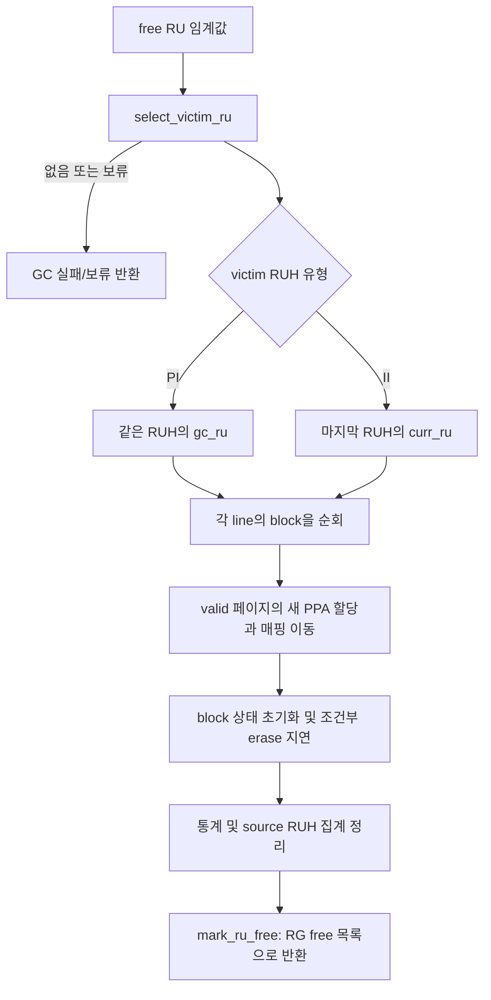

# 6단계 — FDP GC와 II·PI 격리

기준: `master`, 커밋 `e2d5413ff`. 설명은 현재 실행문에 근거하며, 예시는 정상 단일 RG 경로를 가정한다. 소스의 검토 지점과 실험으로 확인된 사실을 구분한다.

이전: [5단계 — 무효화와 queue](05_FDP_invalidation_and_queues.md) · 다음: [7단계 — 통계·이벤트·TRIM](07_FDP_statistics_events_and_trim.md)

## 1. 이번 단원의 질문

**어느 시점에 어떤 RU를 회수하며, 살아 있는 페이지를 어디에 놓아 배치의 분리 상태를 이어 가는가?**

GC를 세 가지 결정으로 나누어 읽는다.

| 결정 | 중심 함수 | 기준 |
|---|---|---|
| GC를 시도할 것인가? | `should_gc_fdp_style`, `should_gc_high_fdp_style` | RG의 free RU 수 |
| 어느 RU를 회수할 것인가? | `select_victim_ru` | 정책, 후보 집합, vpc/ipc, force |
| 유효 페이지를 어디로 보낼 것인가? | `do_gc_fdp_style`, `gc_write_page_fdp_style` | victim RUH의 II/PI 유형 |



## 2. foreground와 background의 호출 위치

### 2.1 foreground: 요청의 페이지 쓰기 루프 앞

출처: [bbssd/ftl.c:2075–2088](/root/workspace/FEMU/hw/femu/bbssd/ftl.c:2075)

```c
    /* foreground GC if needed; cap iterations to avoid infinite loop */
    {
        int fg_gc_iters = 0;
        int max_fg_gc = (int)(ssd->nrg > 1 ? ssd->nrg : 1);
        //change to ngrp.
        while (should_gc_high_fdp_style(ssd) >= 0 &&
               fg_gc_iters < max_fg_gc) {
            r = do_gc_fdp_style(ssd, rgid, ruhid, true);
            if (r == -1) {
                break;
            }
            fg_gc_iters++;
        }
    }
```

high 조건을 만족하면 `force=true`로 GC를 시도한다. 한 번의 쓰기 호출에서 최대 시도 수는 `max(nrg,1)`이다. 한 RG이면 최대 한 번이다. 충분한 free 공간이 생길 때까지 무제한 반복하는 루프가 아니다.

`should_gc_high_fdp_style()`는 조건을 만족한 RG 인덱스를 반환하지만 이 루프는 그 값을 `>=0` 판단에만 사용한다. 실제 GC에는 **현재 쓰기 요청의 `rgid`와 `ruhid`**를 전달한다. 다중 RG에서는 압력이 감지된 RG와 회수할 RG가 다를 수 있으므로 별도 확인이 필요하다.

### 2.2 background: 요청을 completion ring에 넣은 뒤

출처: [bbssd/ftl.c:2600–2608](/root/workspace/FEMU/hw/femu/bbssd/ftl.c:2600)

```c
                if (!((rgidx = should_gc_fdp_style(ssd)) < 0))
                {
                    //do_gc_fdp_style(ssd, rgidx, 0, false);
                    if (ssd->nrg == 1)
                        do_gc_fdp_style(ssd, 0, 0, false);
                    else
                    {
                        do_gc_fdp_style(ssd, rgidx, 0, false);
                    }
```

일반 임계값을 만족한 RG에 `force=false`로 한 번 시도한다. 호출 위치는 요청 처리 및 `to_poller` enqueue 뒤다(`ftl.c:2585–2594`). 요청 처리 루프에서 호출되는 background GC이지, 여기서 별도의 GC worker를 생성하는 것은 아니다.

또한 입력 ring이 비어 있으면 루프 앞의 `continue`로 넘어간다(`ftl.c:2552–2553`). 이 경로를 독립적인 idle GC 타이머로 해석하면 안 된다. 물리 자원에 반영한 GC 지연은 후속 요청의 NAND 일정에 영향을 줄 수 있지만, 여기서 GC의 모든 시간을 이번 요청의 `reqlat`에 직접 더하지는 않는다.

## 3. victim 정책: enum과 실제 switch를 대응시킨다

출처: [bbssd/ftl.c:1533–1548](/root/workspace/FEMU/hw/femu/bbssd/ftl.c:1533)

```c
    struct ru_mgmt *rm = ssd->rg[rgid].ru_mgmt;
    FemuReclaimUnit *victim_ru = NULL;

    switch (rm->mgmt_type) {
    case GC_GLOBAL_GREEDY:
        victim_ru = pqueue_pop(rm->victim_ru_pq);
        break;

    case GC_GLOBAL_CB:
        victim_ru = pqueue_pop(rm->victim_ru_cb);

        break;

    case GC_GLOBAL_RAND:
        victim_ru = pqueue_randpop(rm->victim_ru_pq);
        break;
```

“GLOBAL”이라는 이름의 후보 집합은 여기서 전달된 **RG의 victim heap**이다. 모든 RG를 통합한 heap이 아니다.

| 전략 | 현재 `select_victim_ru()`의 실제 경로 |
|---|---|
| `GC_GLOBAL_GREEDY` | RG의 vpc heap에서 pop |
| `GC_GLOBAL_CB` | RG의 my_cb heap에서 pop |
| `GC_GLOBAL_RAND` | RG의 vpc heap에서 `pqueue_randpop` |
| `GC_NOISY_RUH_CUSTOM` | 조건을 만족하는 RUH들의 heap head를 비교하고 없으면 global greedy fallback |
| `GC_SELECTIVE_RUH`, `GC_EXPLOIT_SEQUENTIAL` | RG vpc heap에서 pop |
| `GC_SELECTIVE_RUH_SOCIAL_WELFARE` | 전달받은 RUH의 heap에서 pop |
| `GC_BIT_POPULATION`, `GC_GLOBAL_WARM`, `GC_SELECTIVE_RUH_ADV`, `GC_SELECTIVE_MIDAS_OP`, default | greedy fallback |

나머지 분기의 근거는 다음과 같다.

출처: [bbssd/ftl.c:1614–1630](/root/workspace/FEMU/hw/femu/bbssd/ftl.c:1614)

```c
    case GC_SELECTIVE_RUH:
    case GC_EXPLOIT_SEQUENTIAL:
        victim_ru = pqueue_pop(rm->victim_ru_pq);
        break;

    case GC_SELECTIVE_RUH_SOCIAL_WELFARE:
        victim_ru = select_victim_ru_from_ruh(ssd, rgid, ruhid);
        break;

    case GC_BIT_POPULATION:
    case GC_GLOBAL_WARM:
    case GC_SELECTIVE_RUH_ADV:
    case GC_SELECTIVE_MIDAS_OP:
    default:
        /* fallback to greedy */
        victim_ru = pqueue_pop(rm->victim_ru_pq);
        break;
```

따라서 enum에 이름이 있다고 해당 논문의 정책이나 이름에 대응하는 고유 알고리즘이 구현되었다고 설명하지 않는다. 5단계에서 본 heap 갱신 문제 때문에 greedy heap의 head가 항상 실제 최소 vpc라는 주장도 별도의 검증이 필요하다.

RAND는 `rand() % (q->size - 1) + 1`로 heap 배열 인덱스를 선택한다(`lib/pqueue.c:196–215`). 무효 페이지 비율을 가중치로 주는 샘플링은 이 코드에 없다. 난수 시드와 재현성은 실행 환경을 따로 기록해야 한다.

### 3.1 NOISY: RUH를 걸러내고 head끼리 비교한다

출처: [bbssd/ftl.c:1558–1573](/root/workspace/FEMU/hw/femu/bbssd/ftl.c:1558)

```c
        for (i = 0; i < (int)ssd->nruhs; i++) {
            if (!ssd->ruhs[i].ru_mgmt) {
                continue;
            }
            if (ssd->ruhs[i].ru_in_use_cnt <=
                ssd->ruhs[i].ru_mgmt->custom_gc_threshold) {
                continue;
            }
            ru = pqueue_peek(ssd->ruhs[i].ru_mgmt->victim_ru_pq);
            if (!ru) {
                continue;
            }
            if (!victim_ru || ru->vpc < victim_ru->vpc) {
                best_ruh = i;
                victim_ru = ru;
            }
```

RUH별 관리 객체가 있어야 하며 `ru_in_use_cnt > custom_gc_threshold`일 때만 고려한다. 각 RUH heap의 head 중 가장 작은 vpc를 선택한다. 모든 RU를 선형 탐색하는 함수는 아니다.

현재 `ftl.c`에서 `custom_gc_threshold`는 초기화 시 0으로 설정되며, 이를 workload에 따라 적응적으로 갱신하는 실행문은 확인되지 않는다. 필드 이름만으로 동적인 noisy stream 탐지 알고리즘이라고 설명할 수 없다.

선택 성공 시 RUH heap에서 pop하고 global heap에서도 제거한다(`ftl.c:1575–1593`). RUH 후보가 없으면 global에서 pop한 뒤 남아 있는 per-RUH 참조를 제거한다(`ftl.c:1595–1609`). 5단계의 위치 필드 분리는 이 동시 소속 정리에 필요하다.

NOISY의 RUH 순회에는 후보의 `rgidx == 요청 rgid` 필터가 없다. 여러 RG가 같은 RUH 관리 객체에 연결되는 설정에서는 global queue 제거 대상의 RG까지 확인해야 한다. 이번 설명의 정상 예시는 RG 하나다.

### 3.2 SOCIAL_WELFARE 경로의 도달 가능성

해당 분기는 `select_victim_ru_from_ruh()`를 호출한다. 하지만 현재 per-RUH victim 삽입은 NOISY 분기에 제한되어 있고, RU 소진 경로도 global에만 넣는다. 따라서 새 장치를 이 전략으로 초기화했다고 RUH별 heap이 자동으로 채워진다고 가정하면 안 된다. helper가 존재하는 것과 완성된 정책으로 동작하는 것은 다른 문제다.

## 4. force는 무엇을 생략하는가?

출처: [bbssd/ftl.c:1633–1650](/root/workspace/FEMU/hw/femu/bbssd/ftl.c:1633)

```c
    if (!victim_ru) {
        /*
         * victim_ru_pq is empty: all in-use RUs are still fully written
         * with no invalidations yet (e.g., during sequential fill). There is
         * no victim to reclaim, so returning NULL is the correct behavior.
         */
        return NULL;
    }

    if (!force && victim_ru->vpc > 0) {
        int threshold = victim_ru->npages / 8;
        if (victim_ru->ipc < threshold) {
            /* put it back */
            FDP_TRACE(ssd, "GC_BACK_RESERT triggered but delay GC (ru %d ipc %d threshold %d full %d)\n",victim_ru->ruidx, victim_ru->ipc, threshold, victim_ru->npages);
            if (rm->mgmt_type == GC_GLOBAL_CB){
                pqueue_insert(rm->victim_ru_cb, victim_ru);
            }else{
                pqueue_insert(rm->victim_ru_pq, victim_ru);
```

victim이 없으면 NULL이다. 후보가 있더라도 `force=false`, `vpc>0`, `ipc < npages/8`이면 되돌려 넣고 이번 GC를 보류한다. NOISY의 per-RUH 재등록은 `ftl.c:1657–1661`에 이어진다.

| 가상 RU 용량 64페이지 | background (`force=false`) | foreground (`force=true`) |
|---|---|---|
| vpc=60, ipc=4 | 임계값 8 미만이므로 보류 | 이 ipc 보류 조건을 건너뜀 |
| vpc=56, ipc=8 | 보류 조건을 통과 | 통과 |
| vpc=0, ipc=64 | vpc>0 조건에 해당하지 않아 통과 | 통과 |
| 후보 heap이 비어 있음 | 선택 실패 | 선택 실패 |

`force=true`는 이 보류 기준을 생략할 뿐 full 목록이나 활성 RU를 강제로 골라 오는 기능이 아니다. 또한 하나의 후보를 보류하면 이 함수는 그 호출에서 다른 후보를 계속 찾지 않고 NULL을 반환한다. `npages/8`은 정수 나눗셈이므로 작은 RU의 경계도 다르다.

최종 선택 성공 시 `pos=0`, `ruh_pos=0`, RG의 `victim_ru_cnt--`를 수행한다(`ftl.c:1668–1672`). 이 시점부터 RU는 회수 중 상태이며 free 목록에 들어가기 전이다.

## 5. II와 PI는 GC 목적지를 바꾼다

출처: [bbssd/ftl.c:1876–1889](/root/workspace/FEMU/hw/femu/bbssd/ftl.c:1876)

```c
    if (victim_ruh->ruh_type == NVME_RUHT_PERSISTENTLY_ISOLATED) {
        dest_ruh = victim_ruh;
        /* PI RUH: GC writes go to a dedicated gc_ru, distinct from curr_ru. */
        if ((ret = check_gc_ruh_available(ssd, dest_ruh)) < 0 ){
            ftl_err("No free space left in device. \n");
            ftl_assert(false && __LINE__ );
        }

    } else if (victim_ruh->ruh_type == NVME_RUHT_INITIALLY_ISOLATED){
        /* II RUH: GC writes go to the last RUH's curr_ru. */
        dest_ruh = &ssd->ruhs[ssd->nruhs - 1];
        if ((ret = check_gc_ruh_available(ssd, dest_ruh)) < 0 ){
            ftl_err("No free space left in device. \n");
            ftl_assert(false && __LINE__ );
```

PI이면 목적 RUH를 victim의 RUH로 유지한다. II이면 마지막 RUH를 목적지로 삼는다. 실제 페이지 쓰기에서 목적 RU는 다음처럼 결정된다.

출처: [bbssd/ftl.c:1689–1702](/root/workspace/FEMU/hw/femu/bbssd/ftl.c:1689)

```c
    if (dest_ruh->ruh_type == NVME_RUHT_PERSISTENTLY_ISOLATED)
    {
        dest_ru = dest_ruh->gc_ru;
    }else if( dest_ruh->ruh_type == NVME_RUHT_INITIALLY_ISOLATED && dest_ruh->ruhid == ssd->ruhs[ssd->nruhs-1].ruhid ){
        dest_ru = dest_ruh->curr_ru;
    }else{
        ftl_err("Unidentified ruht. ");
        ftl_assert(false && __LINE__);
    }

    new_ppa = fdp_get_new_page(ssd, dest_ru);
    set_maptbl_ent(ssd, lpn, &new_ppa);
    set_rmap_ent(ssd, lpn, &new_ppa);
    mark_page_valid_fdp(ssd, &new_ppa, dest_ru);
```

| 유형 | 목적 RUH | 목적 RU | 호스트용 쓰기 포인터와의 관계 |
|---|---|---|---|
| PI | victim의 동일 RUH | `gc_ru` | 같은 RUH이지만 `curr_ru`와 별도 공간 |
| II | 마지막 RUH | 그 RUH의 `curr_ru` | 해당 RUH의 호스트 쓰기와 현재 RU를 공유 |

`ftl.c:1858–1866`에 PI도 `curr_ru`를 사용한다는 주석이 남아 있지만 실제 분기는 `gc_ru`다. II의 마지막 RUH 규칙도 이 구현의 선택으로 설명한다.

현재 subsystem 초기화는 기본적으로 모든 RUH를 PI로 만들고, `isolation_mode`가 참이면 **마지막 RUH만 II**로 만든다(`femu.c:117–124`). 따라서 기본 설정에서 여러 II 호스트 RUH의 데이터가 하나로 모이는 실험이 자동으로 만들어지는 것은 아니다. 유형 설정과 실제 victim 경로를 함께 봐야 한다.

## 6. 목적지 공간을 먼저 확보한다

출처: [bbssd/ftl.c:1481–1488](/root/workspace/FEMU/hw/femu/bbssd/ftl.c:1481)

```c
    else if(ruh->ruh_type == NVME_RUHT_PERSISTENTLY_ISOLATED){
        if(ruh->gc_ru == NULL){
            ruh->gc_ru = fdp_get_new_ru(ssd, ruh->curr_ru->rgidx, ruh->ruhid);
            ftl_debug("check_gc_ruh_available ruh %d gc_ru idx %d , %p call new ru  \n", ruh->ruhid, ruh->gc_ru->ruidx, ruh->gc_ru );
            if (ruh->gc_ru == NULL){
                //assert(ruh->gc_ru != NULL);//This means no space left
                return -1;
            }
```

PI의 `gc_ru`가 없으면 새 RU를 할당한다. 정상 경로에서는 `curr_ru`의 RG를 기준으로 같은 RUH용 RU를 확보한다. source RU를 아직 지우기 전이므로 free RU가 하나 더 필요할 수 있다.

확인할 조건은 다음과 같다.

- PI의 할당은 `ruh->curr_ru->rgidx`를 읽으므로 `curr_ru`가 유효해야 한다.
- II의 공간 확보 분기는 마지막 RUH의 `curr_ru==NULL`일 때도 `ruh->curr_ru->rgidx`를 읽는다(`ftl.c:1468–1473`). 호출자가 같은 마지막 RUH인 경로에서는 NULL 역참조 위험이 있다.
- PI의 debug 출력은 NULL 검사보다 먼저 `gc_ru->ruidx`를 참조한다. 그 인자의 평가 여부는 `ftl_debug` 매크로가 활성화되는지에 달린다.
- 목적지 할당이 실패한 시점에는 victim이 이미 heap에서 제거되었다. 이 실패를 정상적인 “후보 되돌림 후 다음 victim 시도”로 설명해서는 안 된다.

위 사항은 소스 경로에서 드러난 전제와 실패 위험이다. 실제 재현 실험을 했다는 의미는 아니다.

## 7. RU의 각 block을 순회하며 valid 페이지만 옮긴다

`do_gc_fdp_style()`은 victim의 line들을 돌고, 각 line에서 channel/LUN의 block들을 순회한다(`ftl.c:1911–1921`). 내부 함수는 다음과 같다.

출처: [bbssd/ftl.c:1764–1776](/root/workspace/FEMU/hw/femu/bbssd/ftl.c:1764)

```c
    for (int pg = 0; pg < spp->pgs_per_blk; pg++) {
        ppa->g.pg = pg;
        pg_iter = get_pg(ssd, ppa);
        ftl_assert(pg_iter->status != PG_FREE);
        if (pg_iter->status == PG_VALID) {
            gc_read_page(ssd, ppa);
            gc_write_page_fdp_style(ssd, ppa, dest_ruh);
            cnt++;
        }
    }

    ftl_assert(get_blk(ssd, ppa)->vpc == cnt);
    return cnt;
```

RU가 닫힌 후보라는 전제로 block에 free 페이지가 없어야 한다고 검사한다. valid 페이지만 읽고 이동한다. invalid 페이지는 복사하지 않는다. 반환값은 실제 이동한 페이지 수다.

GC 페이지 쓰기는 destination RUH를 인자로 받으며 매 호출마다 `gc_ru` 또는 `curr_ru`를 다시 읽는다. 따라서 GC 중 목적 RU가 소진되어 포인터가 바뀌어도 이후 페이지는 새 목적 RU를 따라갈 수 있다. 고정된 RU 포인터를 모든 페이지에 계속 전달하면 이 전환을 놓칠 수 있다.

### 7.1 GC 목적 RU도 소진될 수 있다

출처: [bbssd/ftl.c:1719–1735](/root/workspace/FEMU/hw/femu/bbssd/ftl.c:1719)

```c
    if(dest_ruh->ruh_type == NVME_RUHT_PERSISTENTLY_ISOLATED ){
        // handle ruh->ru pointer after adv
        if( (ret_ru = fdp_advance_ru_pointer(ssd, &ssd->rg[dest_ru->rgidx], dest_ru->ruh, dest_ru)) != dest_ru){
            dest_ruh->gc_ru = ret_ru;
        }
    }else if (dest_ruh->ruh_type == NVME_RUHT_INITIALLY_ISOLATED ){
        int gcruh_id = ssd->nruhs-1;
        ftl_assert( dest_ruh->ruhid == gcruh_id );
        if( (ret_ru = fdp_advance_ru_pointer(ssd, &ssd->rg[dest_ru->rgidx], dest_ruh, dest_ru)) != dest_ru ) {
            //Do ugly updates
            ssd->ruhs[gcruh_id].rus[dest_ru->rgidx] = ret_ru;
            ssd->ruhs[gcruh_id].curr_ru = ret_ru;
            ssd->ruhs[gcruh_id].ruh->rus[dest_ru->rgidx] = ret_ru->nvme_ru;
        } 
    }
    
    ftl_assert((ret_ru != NULL));
```

PI는 반환된 새 RU를 `gc_ru`에 저장한다. II는 마지막 RUH의 `rus[]`, `curr_ru`, NVMe 측 참조를 바꾼다.

공통 `fdp_get_new_ru()`는 NVMe RUH의 참조도 변경한다. 따라서 PI의 GC RU 할당/교체 뒤에는 NVMe `ruh->rus[rg]`가 FTL 호스트 `curr_ru`와 다른 RU를 가리킬 수 있다. 7단계의 RUH Status가 어느 객체를 읽는지와 연결해 이해한다.

II는 `ret_ru`를 NULL 검사 전에 역참조하는 대입이 있으며, 공통 진행 함수의 실패가 PI 호스트 `curr_ru`까지 NULL로 만들 수 있다는 점도 실패 경로 검토 대상이다. 정상적인 RU 교체와 공간 소진의 동작을 같은 것으로 취급하지 않는다.

## 8. GC는 source 무효화 함수를 페이지마다 호출하지 않는다

복사 시 `set_maptbl_ent`, 새 PPA의 `set_rmap_ent`, `mark_page_valid_fdp`를 수행한다(`ftl.c:1699–1702`). 이 함수에는 source에 대한 `mark_page_invalid_fdp()` 호출이 없다. source의 페이지 상태는 뒤의 block 초기화로 정리하고 RUH의 live page 수는 GC 끝에 일괄 차감한다.

출처: [bbssd/ftl.c:1952–1955](/root/workspace/FEMU/hw/femu/bbssd/ftl.c:1952)

```c
    if (ssd->ruhs[victim_ru->ruh->ruhid].ru_in_use_cnt > 0) {
        ssd->ruhs[victim_ru->ruh->ruhid].ru_in_use_cnt--;
    }
    ssd->ruhs[victim_ru->ruh->ruhid].ruh_live_pages_cnt -= vpc_cnt;
```

PI에서 v개를 같은 RUH로 옮기면 목적지 valid 처리로 +v, source 정리로 -v가 되어 작업 종료 시 그 RUH의 live page 수는 유지된다. 다른 RUH로 이동하는 II 경로에서는 source -v, destination +v가 된다. GC 도중 중간 값을 읽으면 복사된 페이지가 임시로 양쪽에 계상될 수 있다.

이동 뒤 source PPA의 rmap 엔트리를 명시적으로 지우는 동작도 이 GC 경로에는 없다. `mark_block_free()`는 페이지 상태를 free로 바꾸지만 rmap을 초기화하지 않는다. 따라서 free PPA의 rmap만 보고 유효 데이터가 남았다고 판단하면 안 되며, valid PPA와 현재 maptbl의 상호 일치를 확인해야 한다.

## 9. block 정리, 지연 모델, RU 반환

출처: [bbssd/ftl.c:1921–1932](/root/workspace/FEMU/hw/femu/bbssd/ftl.c:1921)

```c
                vpc_cnt += clean_one_block_fdp_style(ssd, &ppa, dest_ruh);
                
                blk_cnt++;
                mark_block_free(ssd, &ppa);
                if (spp->enable_gc_delay) {
                    struct nand_cmd gce;
                    gce.type = GC_IO;
                    gce.cmd = NAND_ERASE;
                    gce.stime = 0;
                    ssd_advance_status(ssd, &ppa, &gce);
                }
                lunp->gc_endtime = lunp->next_lun_avail_time;
```

각 block을 정리하고, `enable_gc_delay`가 켜져 있으면 NAND erase 지연을 반영한다. GC read/write 지연도 이 옵션으로 제어된다(`ftl.c:755–764`, `1737–1743`). 옵션을 끈다고 매핑 이동이나 GC 통계 자체가 생략되는 것은 아니다.

그 후 GC 통계와 이벤트를 처리하고 `mark_ru_free()`를 호출한다. 이 함수는 RU/line 상태와 write pointer를 재설정한 뒤 아래와 같이 free 목록에 넣는다.

출처: [bbssd/ftl.c:1806–1825](/root/workspace/FEMU/hw/femu/bbssd/ftl.c:1806)

```c
    ru->vpc = 0;
    ru->ipc = 0;
    ru->pos = 0;
    ru->ruh_pos = 0;
    ru->next_line_index = 1;
    ru->utilization = 0.0f;
    ru->my_cb = 0.0f;
    ru->erase_cnt++;
    ru->chance_token = 0;

    fdp_set_ru_write_pointer(ssd, ru);

    /* restore ruamw to initial value */
    ftl_assert(ru->nvme_ru != NULL);
    ftl_assert(ru->ruh != NULL);
    ftl_assert(ru->ruh->ruh != NULL);
    ru->nvme_ru->ruamw = ru->ruh->ruh->ruamw;

    QTAILQ_INSERT_TAIL(&rm->free_ru_list, ru, entry);
    rm->free_ru_cnt++;
```

RU 객체를 `free()`로 메모리 해제하는 함수가 아니다. line 연결과 RU 객체를 유지한 채 재사용 가능한 상태로 돌린다. `ru->ruh`도 여기서 NULL로 지우지 않으며 다음 배정에서 새 소유 RUH로 덮어쓴다.

`mark_ru_free()` 내부도 모든 소속 block에 `mark_block_free()`를 호출한다(`ftl.c:1791–1802`). 위 GC 본문과 중복되어 block의 erase 카운터가 실제로 어떻게 증가하는지는 7단계에서 확인한다.

## 10. “RU 하나 회수”와 “free RU 순증가 1”은 다르다

GC 시작 때 free RU가 F개이고, 목적지를 새로 확보하거나 GC 중 교체하면서 k개의 free RU를 사용하고 victim 하나를 반환했다면:

```text
GC 종료 free RU 수 = F - k + 1
```

- 기존 목적 RU에 충분한 여유가 있으면 k=0이므로 free는 1 증가한다.
- 첫 PI GC RU를 새로 확보하면 k=1일 수 있어 free 순증가는 0이다.
- 목적 RU 경계를 넘으며 더 할당하면 k가 늘어난다.

예를 들어 RU 용량 8페이지, victim `vpc=3`, 기존 `gc_ru`의 여유 5페이지라면 3개를 옮긴 후 목적 RU를 교체하지 않고 source RU를 반환할 수 있다. 반대로 `gc_ru`가 없으면 우선 free RU 하나를 받아야 한다.

GC가 성공해서 victim을 free 목록에 넣었다는 사실만으로 공간 압력이 충분히 해소되었다고 해석하면 안 되는 이유다.

## 11. 확인 질문과 답

1. **global greedy는 모든 RG에서 가장 작은 vpc를 찾는가?**  
   이 함수는 전달받은 RG의 heap에서 pop한다.
2. **force=true이면 victim이 없어도 full RU를 회수하는가?**  
   아니다. 후보가 없으면 실패하며 주로 ipc 보류 조건을 건너뛴다.
3. **PI는 host write와 GC write가 같은 RU인가?**  
   현재 실행문은 같은 RUH 안에서 `curr_ru`와 `gc_ru`를 구분한다.
4. **GC 중 목적 RU가 바뀌는 것을 다음 페이지가 어떻게 아는가?**  
   페이지 이동 함수가 목적 RUH의 현재 목적지 포인터를 다시 읽는다.
5. **GC 한 번이면 free RU는 반드시 1 증가하는가?**  
   아니다. 목적지 할당 비용을 뺀 순변화를 계산해야 한다.
6. **GC delay를 끄면 mbmw에 GC 쓰기가 안 잡히는가?**  
   아니다. GC 통계 갱신은 지연 옵션의 조건문 밖에 있다.
7. **왜 live page 수의 불변조건은 GC 완료 시점에 확인하는가?**  
   목적지 증가와 source의 일괄 차감이 서로 다른 시점에 실행되기 때문이다.
