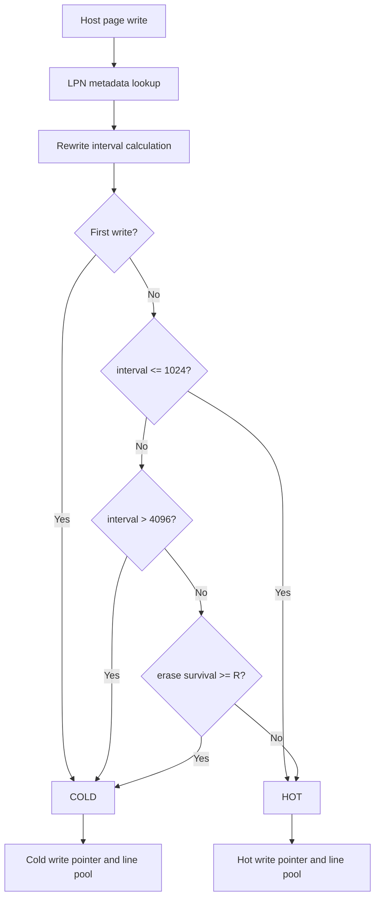

# 1. 제목

## FEMU Blackbox FTL에서 LBA Rewrite Interval과 Erase-Survival Feedback을 이용한 Hot/Cold Data Separation

### Hot/Cold Line Pool 기반 WAF 감소 설계 및 평가

---

# 2. 초록

NAND flash memory는 in-place update를 지원하지 않으므로, Flash Translation Layer(FTL)은 Host update를 새 physical page에 기록하고 기존 page를 invalid 상태로 변경한다. Invalid page가 누적되면 Garbage Collection(GC)이 victim block의 valid page를 복사한 뒤 block을 erase한다. 갱신 간격이 다른 Hot/Cold data가 같은 line에 혼합되면 Cold valid page가 반복 복사될 수 있으며, 이는 NAND write와 Write Amplification Factor(WAF)를 증가시킨다.

본 프로젝트는 FEMU Blackbox FTL의 단일 free-line pool과 write pointer를 Hot/Cold pool과 dual write pointer로 확장하였다. Host page-write sequence에서 동일 LPN이 다시 등장하기까지의 **rewrite interval**을 주 분류 신호로 사용하고, 경계 구간에서는 현재 LPN version이 GC relocation을 통해 source-block logical erase cycle 이후에도 valid data로 유지된 횟수인 `erase_survival_count`를 secondary signal로 사용하였다. 이 counter는 본 프로젝트에서 정의한 **derived metric**이며, 물리 page 자체가 erase를 견디는 횟수나 표준 SSD 지표를 의미하지 않는다.

Host, GC 및 NAND page-write counter를 분리하여 WAF를 계산하고, `NAND writes = Host writes + GC writes`를 포함한 counter invariant를 runtime에 검증하였다. 실험은 raw NAND 8 GiB 중 6 GiB를 Host에 노출한 FEMU Blackbox SSD에서 수행하였다. 전체 6 GiB sequential preconditioning 후, 5 GiB 영역에 Zipf 0.99, 16 KiB random write, queue depth 128, 32 jobs workload를 3600초 실행하였다.

Hot/Cold 분리를 적용하지 않은 Baseline의 WAF는 `7.990`, 제안 V3의 WAF는 `6.981`로, 단일 seed 실험에서 12.6% 감소하였다. 단순히 rewrite threshold를 4096까지 확장한 V1 control의 WAF는 `6.973`이었다. V1 T=4096과 V3의 WAF는 매우 유사했으며, 버전별 1회 실행으로는 두 configuration의 우열을 판정할 수 없다. Erase-survival feedback은 실제 placement를 변경했지만 전체 Host writes의 0.133%에만 적용되었고, threshold-only control 대비 **추가적인 WAF 이득은 확인되지 않았다**. 따라서 본 결과는 Hot/Cold placement의 Baseline 대비 개선과 erase-survival mechanism의 기능적 동작을 보여주지만, 실제 SSD 수명 증가나 secondary signal의 추가 성능 효과를 직접 입증하지는 않는다.

**핵심어:** FEMU, Blackbox FTL, Hot/Cold Data Separation, Rewrite Interval, Garbage Collection, Write Amplification Factor

---

# 3. 서론

## 3.1 연구 배경

SSD는 NAND flash의 erase-before-write 제약을 숨기기 위해 LBA와 physical page 사이의 mapping을 FTL에서 관리한다. 같은 logical address에 쓰기가 발생하면 이전 physical page를 invalid로 만들고 새 free page에 기록한다. 이 방식은 page 단위 update를 가능하게 하지만, 공간을 회수할 때 valid page copy와 block erase를 동반한다 [1], [5].

자주 갱신되는 Hot data와 갱신 간격이 긴 Cold data가 같은 line에 배치되면, Hot page의 invalidation으로 GC가 빨라져도 Cold page는 valid로 남을 수 있다. 이때 Cold valid page가 GC마다 재배치되면 Host가 요청하지 않은 NAND write가 증가한다. Update frequency나 recency에 따라 data를 구분하고 서로 다른 block에 clustering하는 방법이 GC overhead를 줄일 수 있다는 점은 기존 연구에서도 논의되었다 [2]–[4].

## 3.2 프로젝트 목표와 시나리오

본 프로젝트의 직접적인 목표는 FEMU Blackbox FTL에 Hot/Cold placement를 구현하고, GC valid-page copy와 WAF가 Baseline 대비 어떻게 변하는지 측정하는 것이다. 실제 SSD의 program/erase endurance 소진 시점은 측정하지 않았다.

과제의 필수 비교를 본문 앞부터 다음과 같이 정의한다.

- **Scenario 1:** Hot/Cold data 분리를 적용하지 않은 기존 Blackbox FTL(Baseline)
- **Scenario 2:** Rewrite interval, erase-survival feedback 및 Hot/Cold line pool을 적용한 V3 FTL

추가로 V1 T=1024와 V1 T=4096를 control로 사용하여, rewrite interval 범위를 넓힌 효과와 erase-survival feedback의 추가 효과를 분리하였다.

## 3.3 주요 구현 범위

1. 기존 단일 free-line pool과 write pointer를 Hot/Cold pool과 dual write pointer로 확장하였다.
2. Host-write sequence 기준 rewrite interval을 이용해 LPN update frequency를 추정하였다.
3. 경계 interval에서 project-defined erase-survival count를 secondary signal로 사용하였다.
4. GC relocation이 Host access history를 학습하지 않도록 metadata lifecycle을 분리하였다.
5. Host/GC/NAND write 및 mechanism counter를 추가하고 invariant로 correctness를 검증하였다.

---

# 4. 배경 및 설계 동기

## 4.1 FEMU Blackbox FTL과 주소 구조

FEMU는 QEMU를 기반으로 SSD controller와 NAND timing을 emulation하는 플랫폼으로, firmware 수준 FTL 정책을 실험할 수 있다 [1]. Blackbox mode에서 Host LBA는 4 KiB 단위 LPN으로 변환되고 page mapping table을 통해 PPA와 연결된다. Reverse mapping table은 GC가 victim page의 logical owner를 찾을 때 사용된다.

본 실험의 geometry는 다음과 같다.

| 항목 | 값 |
|---|---:|
| Page size | 4 KiB |
| Pages per block | 256 |
| Blocks per plane | 128 |
| Planes per LUN | 1 |
| LUNs per channel | 8 |
| Channels | 8 |
| Raw NAND | 8 GiB |
| Host-exposed capacity | 6 GiB |
| Over-provisioning | 25% |

FEMU의 line은 모든 channel/LUN에서 동일 block number를 갖는 block 64개의 묶음이다. 한 line은 `256 × 8 × 8 = 16,384` page를 포함하며, line GC 한 번에 64개 block이 logical erase 경로를 통과한다. V3 결과에서 `block_erases = 3,715,264 = 58,051 × 64` 관계가 성립하였다.

## 4.2 WAF와 GC 비용

본 프로젝트의 WAF 정의는 다음과 같다.

\[
WAF=\frac{NAND\ Page\ Writes}{Host\ Page\ Writes}
=1+\frac{GC\ Page\ Writes}{Host\ Page\ Writes}
\]

GC write는 GC 발생 횟수와 victim line 한 개에서 복사한 valid page 수로 분해할 수 있다.

\[
Average\ GC\ Copy=\frac{GC\ Page\ Writes}{GC\ Count}
\]

\[
GC\ Page\ Writes=Average\ GC\ Copy\times GC\ Count
\]

3600초 time-based workload에서는 FTL별 처리량이 다르므로 GC count 절대값만으로 비교할 수 없다. 따라서 백만 Host page writes당 GC count를 normalized GC frequency로 함께 보고한다. WAF가 victim block의 valid-page 비율과 over-provisioning에 큰 영향을 받는다는 기존 분석은 이 분해와 일치한다 [5].

## 4.3 Hot/Cold clustering의 동기

Hot/Cold 분리의 핵심은 HOT 판정 횟수를 늘리는 것이 아니라, 유사한 logical lifetime을 갖는 data를 같은 line에 모으는 것이다. Hot page가 모인 line은 invalid page가 빠르게 증가하여 적은 valid-page copy로 회수될 가능성이 있고, Cold line은 상대적으로 오래 유지될 수 있다 [3], [4].

Hot-data identification 연구는 frequency 뿐 아니라 recency도 분류 정확도에 중요함을 보여준다 [2]. 본 구현의 rewrite interval은 별도의 time window를 두지 않고 recency와 update frequency를 같이 근사하는 간단한 신호다. 다만 Hot/Cold classifier의 복잡도가 항상 추가 WAF 이득으로 연결되는 것은 아니며, 분류 오류와 Hot 비율 선택에 따라 추가 이득이 작을 수 있다 [4]. 이 점은 V1 T=4096과 V3를 별도 control로 비교한 이유이다.

---

# 5. 제안 FTL 설계

## 5.1 전체 구조

제안 구조는 LPN metadata, Host rewrite classifier, Hot/Cold write pointer, class별 free-line pool 및 기존 global victim queue로 구성된다.



**Figure 1. V3 Hot/Cold classifier architecture.** Rewrite interval이 명확한 fast/slow 구간을 우선 판정하고, 경계 구간에서만 erase-survival feedback을 사용한다.

Host write는 classifier가 새 state를 결정한 후 해당 write pointer로 기록된다. GC relocation은 classifier를 다시 실행하지 않고 저장된 state만 읽는다. 이로써 SSD 내부 data movement가 Host access로 잘못 학습되는 것을 방지한다.

## 5.2 Hot/Cold line pool

총 128개 line을 초기 64개 Hot, 64개 Cold free-line pool로 나누고, `wp_hot`과 `wp_cold`가 각각 active line을 소유한다. **50:50은 workload에 대한 최적값이 아니라 classifier 비교를 위한 초기 통제값**이다.

한쪽 pool이 비면 반대 pool의 free line을 빌리고 requested class로 변경한다. 해당 line은 향후 GC로 회수될 때 변경된 class pool로 돌아간다. 따라서 50:50은 고정 partition이 아니며, borrowing은 한쪽 pool 부족 시 진행을 유지하는 안전 장치다. Victim selection은 Hot/Cold별 별도 GC policy가 아니라 기존 global valid-page-count priority queue를 유지한다. 즉, 본 실험의 변수는 victim policy가 아니라 **placement separation**이다.

## 5.3 Host-write sequence 기준 rewrite interval

각 4 KiB Host page write를 처리할 때 `host_write_seq`를 1 증가시킨다. 동일 LPN의 현재 sequence와 직전 write sequence의 차이를 rewrite interval로 정의한다.

\[
Interval(LPN)=Current\ Host\ Write\ Seq-Last\ Write\ Seq(LPN)
\]

Interval이 작을수록 전체 Host write stream에서 해당 LPN이 빨리 다시 등장한 것이므로 update frequency가 높다고 추정한다. 16 KiB fio write는 FTL에서 최대 네 개의 4 KiB page write로 처리되므로 sequence의 단위는 fio request가 아니라 FTL page write다.

이 값은 **wall-clock frequency와 다르다**. 예를 들어 interval 1024는 1024개의 다른 Host page write가 사이에 있었음을 뜻할 뿐, 몇 ms 또는 몇 초가 흘렀는지를 나타내지 않는다. 전체 I/O rate가 달라지면 같은 sequence interval이 대응하는 실제 시간도 달라진다. 반면 emulator 실행 속도와 Host scheduling의 변동에 덜 의존하며, workload 내 상대적 recency를 간단히 나타낸다. 따라서 본 보고서는 이를 시간 당 요청 횟수가 아니라 **rewrite interval을 이용한 LBA update-frequency proxy**로 표현한다.

## 5.4 Project-defined erase-survival metric

`erase_survival_count`는 현재 LPN version이 Host overwrite로 invalidation되지 않은 상태에서, GC relocation을 통해 source-block logical erase cycle을 통과한 횟수이다. 여기서 살아남는 대상은 기존 physical page가 아니라 **logical data version**이다. GC가 valid data를 새 page로 이동한 후 source page는 free 상태가 된다.

이 counter는 SMART와 같은 표준 장치 지표가 아니며, 장치 전체의 block erase total을 그대로 classifier에 넣은 것도 아니다. 과제의 erase activity를 LPN current-version 단위로 연결하기 위해 본 프로젝트가 정의한 derived signal이다. Host write가 새 version을 만들면 0으로 reset되고, TRIM은 전체 LPN metadata를 UNSEEN 상태로 초기화한다.

## 5.5 최종 classification rule

기본 parameter는 `T_fast=1024`, `T_slow=4096`, `R=1`이다.

| 조건 | State | Reason |
|---|---|---|
| First Host write | COLD | `FIRST_WRITE` |
| `interval <= 1024` | HOT | `FAST_REWRITE` |
| `1024 < interval <= 4096`, `survival < 1` | HOT | `BOUNDARY_HOT` |
| `1024 < interval <= 4096`, `survival >= 1` | COLD | `ERASE_SURVIVAL_COLD` |
| `interval > 4096` | COLD | `SLOW_REWRITE` |

Fast/slow evidence가 명확한 구간에서는 secondary signal이 판정을 뒤집지 않는다. Erase survival은 rewrite interval만으로 판정하기 애매한 경계 구간에서만 COLD 쪽으로 보정한다.

## 5.6 Host, GC, TRIM metadata lifecycle

| 경로 | Rewrite history | State | Erase survival |
|---|---|---|---|
| Host write | 갱신 | 재분류 | 새 version이므로 0 |
| GC relocation | 변경 없음 | 기존 state 유지 | source erase 경로에서 +1 |
| TRIM | 초기화 | UNSEEN | 0 |

GC relocation은 `last_write_seq`, `write_count`, `update_interval`을 변경하지 않는다. 따라서 classifier의 입력은 Host behavior와 SSD internal movement 사이에서 분리된다.

---

# 6. 코드 구현

본 장은 `hotcold/v3` commit `cbb044e32ea4714037e956aaba653b301a25779d`의 실제 구현 중 설계를 직접 보여주는 네 개 Listing만 인용한다. Pool 초기화, borrowing, state-to-pointer helper, TRIM, admin command, runtime environment 전달 등의 세부 코드는 재현성 artifact의 source commit에서 확인할 수 있다.

## 6.1 LPN metadata

**Listing 1. LPN state와 current-version metadata**

출처: `hw/femu/bbssd/ftl.h:41-61`

```c
typedef enum LpnState {
    LPN_STATE_UNSEEN = 0,
    LPN_STATE_COLD,
    LPN_STATE_HOT,
} LpnState;

typedef struct LpnMeta {
    uint64_t last_write_seq;
    uint64_t update_interval;
    uint32_t write_count;
    uint32_t erase_survival_count;
    LpnState state;
} LpnMeta;
```

`write_count=0`은 first-write 판정에 사용된다. `last_write_seq`와 `update_interval`은 Host rewrite history, `erase_survival_count`는 current version의 derived erase feedback, `state`는 placement class를 나타낸다. 2,097,152개 LPN에 대해 alignment 포함 entry당 32 bytes, 총 약 64 MiB를 사용한다.

## 6.2 Rewrite classifier

**Listing 2. Rewrite interval과 erase survival의 경계 판정**

출처: `hw/femu/bbssd/ftl.c:736-780`

```c
if (meta->write_count == 0) {
    meta->update_interval = 0;
    meta->state = LPN_STATE_COLD;
    reason = CLASS_REASON_FIRST_WRITE;
} else {
    meta->update_interval = ssd->host_write_seq - meta->last_write_seq;
    if (meta->update_interval <= ssd->hot_rewrite_window) {
        meta->state = LPN_STATE_HOT;
        reason = CLASS_REASON_FAST_REWRITE;
    } else if (meta->update_interval > ssd->hot_boundary_window) {
        meta->state = LPN_STATE_COLD;
        reason = CLASS_REASON_SLOW_REWRITE;
    } else if (*survival_before >= ssd->erase_survival_threshold) {
        meta->state = LPN_STATE_COLD;
        reason = CLASS_REASON_ERASE_SURVIVAL_COLD;
    } else {
        meta->state = LPN_STATE_HOT;
        reason = CLASS_REASON_BOUNDARY_HOT;
    }
}

meta->last_write_seq = ssd->host_write_seq;
if (meta->write_count != UINT32_MAX) {
    meta->write_count++;
}
meta->erase_survival_count = 0;
```

Classifier의 분기와 new-version metadata reset을 한 함수에 두어 lifecycle을 명확하게 했다. Reason counter는 생략한 각 분기에서 갱신되며 최종 stats의 mechanism coverage와 invariant에 사용된다.

## 6.3 Source-block erase feedback

**Listing 3. Valid LPN version의 erase-survival update**

출처: `hw/femu/bbssd/ftl.c:1111-1157`

```c
static void ssd_record_erase_survivor(struct ssd *ssd,
                                      struct ppa *source_ppa)
{
    uint64_t lpn = get_rmap_ent(ssd, source_ppa);
    LpnMeta *meta = &ssd->lpn_meta[lpn];

    if (meta->erase_survival_count != UINT32_MAX) {
        meta->erase_survival_count++;
    }
}

for (int i = 0; i < spp->pgs_per_blk; i++) {
    pg = &blk->pg[i];
    if (!ssd->fdp_enabled && pg->status == PG_VALID) {
        source_ppa.g.pg = i;
        ssd_record_erase_survivor(ssd, &source_ppa);
    }
    pg->status = PG_FREE;
}
blk->erase_cnt++;
ssd->block_erases++;
```

Valid page relocation 후 source block을 free로 만드는 경로에서 reverse mapping으로 LPN을 찾아 count를 올린다. 즉 단순 GC 함수 호출 횟수가 아니라 실제 source-block logical erase 경계에 연결한다. 다만 이 값은 LPN의 logical lifetime 뿐 아니라 해당 LPN이 배치된 line의 GC 빈도에도 영향을 받는다.

## 6.4 WAF과 counter invariant

**Listing 4. WAF 계산과 accounting invariant**

출처: `hw/femu/bbssd/ftl.c:111-141`

```c
bool counters_valid =
    ssd->nand_page_writes ==
        ssd->host_page_writes + ssd->gc_page_writes &&
    ssd->host_hot_writes + ssd->host_cold_writes ==
        ssd->host_page_writes &&
    ssd->gc_hot_writes + ssd->gc_cold_writes ==
        ssd->gc_page_writes &&
    ssd->boundary_survival_zero + ssd->boundary_survival_one +
        ssd->boundary_survival_two +
        ssd->boundary_survival_three_plus ==
        ssd->host_hot_boundary_writes +
        ssd->host_cold_survival_writes;

snprintf(waf, sizeof(waf), "%.6f",
         (double)ssd->nand_page_writes /
         (double)ssd->host_page_writes);
snprintf(average_gc_copy, sizeof(average_gc_copy), "%.6f",
         (double)ssd->gc_page_writes / (double)ssd->gc_count);
```

Host program은 Host/NAND counter를, GC relocation program은 GC/NAND counter를 각각 함께 증가시킨다. Stats 출력에서 write accounting, Hot/Cold routing 및 boundary reason histogram을 동시에 검증하고 전체가 성립할 때 `counter_invariant=PASS`를 출력한다.

---

# 7. Correctness 검증

Correctness test와 performance test를 분리하였다. Correctness에서는 marker LPN과 제한된 address range를 사용해 특정 분기와 GC relocation을 추적했다. Performance workload에서는 marker와 offset을 사용하지 않았다.

## 7.1 핵심 검증 결과

| 검증 항목 | 기대 동작 | 결과 |
|---|---|---|
| First write | COLD / `FIRST_WRITE` | PASS |
| `interval <= T_fast` | HOT / `FAST_REWRITE` | PASS |
| Boundary, survival=0 | HOT / `BOUNDARY_HOT` | PASS |
| Boundary, survival≥R | COLD / `ERASE_SURVIVAL_COLD` | PASS |
| `interval > T_slow` | COLD / `SLOW_REWRITE` | PASS |
| TRIM 후 first write | Metadata reset 후 COLD | PASS |
| GC relocation | Rewrite history 불변, survival만 갱신 | PASS |
| Runtime parameter | 0, 잘못된 threshold 관계 거부 | PASS |
| Counter accounting | 모든 invariant 성립 | PASS |

## 7.2 Erase-survival branch 강제 관찰

기본 parameter에서 marker LPN이 GC victim에 포함되는 순간을 짧은 시간에 재현하기 어렵기 때문에, correctness 전용 run에서 `T_slow=2,000,000`으로 경계 구간을 넓혔다. **이 값은 erase-survival branch를 강제로 관찰하기 위한 기능 검증용이며 performance 결과에는 사용하지 않았다.**

Marker LPN 0의 logical version은 Host overwrite 없이 34회 GC relocation/source erase cycle을 통과했고, 다음 경계 write에서 `survival_before=34`, `reason=ERASE_SURVIVAL_COLD`로 판정되었다. GC 동안 `last_write_seq`와 `write_count`는 변하지 않았다.

## 7.3 Performance counter sanity

V3 final stats에서 다음 관계를 확인하였다.

```text
951,205,163 NAND writes
= 136,261,216 Host writes + 814,943,947 GC writes

814,943,947 GC writes
= 6,140,884 GC Hot + 808,803,063 GC Cold
```

Host classification reason 합계와 boundary histogram 합계도 각 routing counter와 일치했으며 `counter_invariant=PASS`였다. 이로써 성능 결과를 분석하기 전에 기본 routing·metadata·accounting correctness를 확인하였다.

---

# 8. 실험 환경 및 방법

## 8.1 비교군과 control run 재사용

| 비교군 | Parameter | 역할 | Run 출처 |
|---|---|---|---|
| Baseline | Hot/Cold 분리 없음 | Scenario 1 | 이전 valid 3600초 run 재사용 |
| V1 T=1024 | `interval <= 1024` HOT | 경계를 COLD로 두는 control | 이전 valid 3600초 run 재사용 |
| V1 T=4096 | `interval <= 4096` HOT | 경계를 모두 HOT으로 두는 control | V3 평가 단계에서 신규 실행 |
| V3 | `T_fast=1024`, `T_slow=4096`, `R=1` | Scenario 2, 경계를 survival로 선택 | V3 평가 단계에서 신규 실행 |

Baseline과 V1 T=1024는 동일 geometry, preconditioning, workload, runtime, offset 없음, seed `20260824` 조건을 만족한 이전 valid run을 재사용하였다. V1 T=4096과 V3는 후속 평가에서 새로 실행하였다. 따라서 네 configuration이 한 세션에서 연속 실행된 것은 아니며, 실행 날짜 차이는 10장의 한계에 포함한다.

## 8.2 장치 및 workload

| 항목 | 설정 |
|---|---|
| Host / acceleration | WSL2 / KVM |
| Guest | Ubuntu 20.04 계열, 4 vCPU, 4 GiB |
| Target | `/dev/nvme0n1`, 6 GiB, raw block device |
| Raw NAND / OP | 8 GiB / 25% |
| GC threshold | 75% / 95% |
| fio | 3.16 |
| I/O | `randwrite`, `direct=1`, `libaio` |
| Runtime | 3600 seconds, `time_based=1` |
| Range | `size=5G`, offset 없음 |
| Block size | 16 KiB |
| Queue / jobs | `iodepth=128`, `numjobs=32` |
| Distribution | `zipf:0.99` |
| Seed | `randrepeat=1`, `randseed=20260824` |

Scenario 1, Scenario 2 및 control은 동일 workload를 사용했다. Performance run에는 marker, offset, 중간 snapshot, pause 또는 fio 실행 중 stats reset을 사용하지 않았다.

## 8.3 Fresh-device procedure와 preconditioning

각 run은 이전 QEMU가 완전히 종료된 후 새 FEMU process에서 순차 실행하였다. Target이 정확히 6 GiB이고 partition/mount가 없으며 Guest root disk와 분리되었음을 확인한 후, 전체 6 GiB를 1 MiB sequential write로 한 번 채웠다. `sync` 후 admin command `cdw10=5`로 preconditioning stats를 출력하고 measurement accounting counter만 reset했다. 이후 fio를 3600초 중단 없이 실행하고 완전 종료 후 동일 command로 final stats를 수집했다.

Reset 후에도 mapping, page/line state, write pointer, LPN classifier metadata는 유지된다. 따라서 measurement는 classifier cold-start가 아니라 **sequential fill을 거친 filled-device overwrite 상태**를 측정한다. Performance 대상 LPN이 이미 preconditioning에서 한 번 학습되었기 때문에 V3 measurement의 `FIRST_WRITE=0`이 예상된다.

Sequential preconditioning의 최초 write는 모두 COLD로 분류되므로, 초기 50:50 pool composition은 measurement 시작 전에 borrowing으로 변할 수 있다. V3 preconditioning stats에서 Cold-pool borrowing 33회가 관찰되었다. Measurement counter는 reset되었지만 이 때 형성된 physical pool/line 상태는 유지되었다. 이는 비어 있는 SSD가 아니라 이미 채워진 SSD에서 overwrite를 비교하기 위한 실험 조건이며, 초기 pool 최적화를 의미하지 않는다.

## 8.4 R 선택

최종 seed와 분리된 seed `20260823`의 300초 mechanism run에서 boundary survival histogram을 확인하였다.

| Survival | Boundary events | 비율 |
|---:|---:|---:|
| 0 | 873,192 | 98.442% |
| 1 | 13,820 | 1.558% |
| 2 이상 | 0 | 0% |

분포가 0과 1로 나뉘어 `R=1`을 선택했다. 이 run은 parameter 분포 확인용이며 final WAF 비교에 포함하지 않았다.

## 8.5 유효성 확인

각 run에서 build, target size, partition/mount 부재, root disk 분리, preconditioning, measurement reset, fio return code, 약 3600초 runtime, final stats 및 `counter_invariant=PASS`를 확인하였다. 실험 후는 Guest를 정상 poweroff하고 QEMU 종료를 확인한 뒤 다음 run을 시작했다. Fio write count와 `host_page_writes`가 일치하여 measurement 종료 후 추가 target write가 없었음을 확인하였다.

---

# 9. 실험 결과 및 분석

## 9.1 Scenario 1과 Scenario 2의 WAF


**Figure 2. Baseline vs. V3 WAF.** 동일 seed와 3600초 workload의 단일 run 비교이며 오차막대나 통계적 유의성은 제시하지 않는다.

| Scenario | WAF | Baseline 대비 |
|---|---:|---:|
| Scenario 1: Baseline | 7.990 | 기준 |
| Scenario 2: V3 | 6.981 | -12.6% |

V3에서 Host page write 한 번당 NAND page write 비율은 Baseline보다 12.6% 낮았다. 이는 본 workload와 단일 seed에서 Hot/Cold placement를 포함한 Scenario 2의 NAND write amplification이 Scenario 1보다 작았음을 의미한다. 실제 SSD lifetime이 12.6% 늘었다는 측정 결과는 아니다.

## 9.2 GC 비용과 absolute WAF

Raw counter는 재현성을 위해 원래 정밀도로 보존하고, 본문 해석은 적절한 유효숫자로 표기한다.

| Version | Host writes | GC writes | GC count | Avg GC copy | GC/10⁶ Host | WAF | IOPS |
|---|---:|---:|---:|---:|---:|---:|---:|
| Baseline | 118,774,428 | 830,272,120 | 57,919 | 14,335.1 | 487.64 | 7.990 | 8,224 |
| V1 T=1024 | 125,887,244 | 824,211,118 | 57,982 | 14,214.9 | 460.59 | 7.547 | 8,733 |
| V1 T=4096 | 136,465,940 | 815,130,507 | 58,074 | 14,036.1 | 425.56 | 6.973 | 9,464 |
| V3 | 136,261,216 | 814,943,947 | 58,051 | 14,038.4 | 426.03 | 6.981 | 9,442 |

Baseline 대비 V3의 average GC copy는 약 2.1%, normalized GC frequency는 약 12.6% 낮았다. Lifetime mixing 자체를 직접 세는 counter는 없으므로, Hot/Cold placement가 mixing을 줄였다는 내용은 GC 지표로부터의 해석이다. 직접 측정된 사실은 average GC copy, Host write당 GC 빈도, WAF가 함께 감소했다는 점이다.

절대 WAF가 7∼8 수준으로 높은 것은 한 line의 16,384 page 중 GC 한 번에 평균 14,000 page 이상을 valid data로 복사한 결과와 함께 관찰되었다. 즉 victim에 invalid page가 상대적으로 적어, 얻은 free page에 비해 copy overhead가 크다. 5 GiB active range, 6 GiB exposed capacity, 25% OP, 3600초 sustained Zipf random overwrite 및 기존 global greedy victim policy가 결합된 조건에서 이 현상이 나타났다. 다만 본 실험은 각 요소의 독립적 영향을 분리하지 않았으므로, 특정 한 요소를 높은 absolute WAF의 단일 원인으로 단정하지 않는다.

## 9.3 Classifier ablation


**Figure 3. Classifier ablation.** V1 T=1024는 경계 영역을 COLD, V1 T=4096은 모두 HOT, V3는 erase survival에 따라 HOT/COLD로 선택한다.

V1 T=1024의 WAF는 `7.547`, V1 T=4096은 `6.973`, V3는 `6.981`이었다. V3가 T=1024 control보다 낮은 WAF를 보인 주요 차이는 `1024 < interval <= 4096` 구간을 HOT 후보로 포함한 것이다.

V1 T=4096과 V3의 수치 차이는 약 0.11%에 불과하며, 버전별 단일 run에는 변동성 추정치가 없다. 따라서 두 configuration의 우열은 판정하지 않는다. 본 결과가 지지하는 결론은 **erase-survival feedback의 threshold-only control 대비 추가 WAF 이득이 확인되지 않았다**는 것이다. 두 configuration의 IOPS도 9,464와 9,442로 유사한 수준이었으며 소폭의 차이에 성능적 의미를 부여하지 않는다.

## 9.4 Erase-survival mechanism coverage

V3의 classification reason과 boundary survival 분포는 다음과 같다.

| Reason / survival | Count | Host writes 대비 | Placement |
|---|---:|---:|---|
| `FAST_REWRITE` | 9,351,692 | 6.863% | HOT |
| `BOUNDARY_HOT`, survival=0 | 11,234,028 | 8.245% | HOT |
| `ERASE_SURVIVAL_COLD`, survival=1 | 181,436 | 0.133% | COLD |
| Boundary survival≥2 | 0 | 0% | — |
| `SLOW_REWRITE` | 115,494,060 | 84.759% | COLD |

Boundary event 11,415,464건 중 98.41%는 survival=0으로 V1 T=4096과 동일하게 HOT이었고, 1.59%인 181,436건만 erase signal에 의해 COLD로 바뀌었다. 전체 Host writes에서 placement가 바뀐 비율은 0.133%였다. V1 T=4096의 GC Hot writes 6,198,556건과 V3의 6,140,884건 차이는 erase feedback이 GC destination composition도 실제로 변경했음을 보여주는 mechanism evidence이다. 이 차이를 성능 우위의 근거로는 사용하지 않는다.

V3 measurement에서 `COLD→HOT=8,064,844`, `HOT→COLD=8,061,040`이었고, 두 transition의 합은 Host writes의 11.83%였다. 이는 workload 중 일부 LPN의 temperature 판정이 빈번히 변경되었음을 보여준다. 이러한 churn이 placement consistency에 영향을 줄 가능성은 있지만 line 내 lifetime mixing을 직접 계측하지 않았으므로 WAF와의 직접적 인과관계는 단정하지 않는다.

Measurement 구간의 Cold-pool 부족과 borrowing은 각 10회, Hot-pool 부족과 emergency GC는 0회였다. Cold pool 부족이 일부 발생했지만 borrowing으로 run이 진행되었다. 이 결과는 50:50이 optimal composition이라는 근거가 아니라 고정 할당의 한계와 borrowing의 기능적 동작을 보여주는 보조 지표다.

## 9.5 결과 요약

1. Scenario 2 V3의 WAF는 Scenario 1 Baseline보다 12.6% 낮았다.
2. V3에서 average GC copy와 normalized GC frequency가 Baseline 대비 함께 감소했다.
3. Erase-survival feedback은 Host 및 GC placement를 실제로 변경하였다.
4. V1 T=4096과 V3의 WAF는 매우 유사했으며, 단일 run으로 우열을 판단할 수 없다.
5. Erase-survival feedback의 threshold-only control 대비 추가 WAF 이득은 확인되지 않았다.

---

# 10. 논의 및 한계

## 10.1 과제 요구사항에 대한 구현 해석

Line 재설계는 Hot/Cold free-line list, line class, dual write pointer 및 borrowing으로 구현하였다. WAF 계산과 분리 전후 비교는 Host/GC/NAND counter와 Scenario 1/2 실험으로 수행하였다.

“일정 시간 동안 LBA 요청 빈도 및 SSD 내부 block erase 횟수”는 다음과 같은 operational definition으로 구현하였다.

- LBA signal: wall-clock fixed window가 아니라 Host page-write sequence rewrite interval을 update-frequency proxy로 사용한다.
- Erase signal: global erase total이 아니라 current LPN version에 연결한 project-defined erase-survival count를 사용한다.
- Combination: rewrite interval을 primary signal, erase survival을 경계 구간의 secondary signal로 사용한다.

따라서 과제가 요구한 두 정보를 실제 placement 판정에 모두 반영했지만, 문구를 literal하게 해석한 wall-clock 빈도 window 및 physical block별 erase counter classifier와 동일한 구현은 아니다. 이 차이를 본 설계의 구체적 해석과 한계로 명시한다.

## 10.2 WAF 감소의 의미

V3의 Baseline 대비 WAF 감소는 동일한 수의 Host page write를 처리할 때 필요한 NAND page program 비율이 낮았음을 의미한다. NAND write 부담 감소는 endurance 관점에서 유리할 수 있지만, 실제 SSD 수명은 wear leveling, NAND program/erase endurance, retention, bad block, write disturb 및 workload 변화의 영향을 함께 받는다. 본 실험은 device failure 시점이나 physical wear distribution을 측정하지 않았으므로, WAF 감소율을 SSD lifetime 증가율로 변환하지 않는다.

## 10.3 Erase feedback의 추가 이득이 확인되지 않은 이유

V3에서 erase feedback이 판정을 변경한 비율은 전체 Host writes의 0.133%였다. 나머지 99.867%는 V1 T=4096과 동일한 threshold rule의 결과를 따랐다. 따라서 secondary signal의 영향 범위가 전체 line composition과 GC 행태를 크게 바꾸기에 부족했을 가능성이 있다.

또한 `erase_survival_count`는 순수한 LPN 특성만을 측정하지 않는다. 해당 LPN이 어떤 line에 배치되었는지, 그 line이 얼마나 자주 GC victim이 되는지에도 영향을 받는 derived metric이다. 즉 classifier output인 placement가 다음 erase-survival input에 간접 영향을 줄 수 있으며, 완전히 독립적인 data-hotness signal은 아니다.

이 결과는 mechanism이 잘못 구현되었다는 뜻이 아니다. Correctness trace와 reason counter는 mechanism이 의도대로 동작했음을 보여준다. 다만 본 workload에서 threshold-only control을 넘는 성능 효과는 확인하지 못했다. 따라서 기능 correctness와 WAF 효과를 분리해 해석해야 한다.

## 10.4 실험 및 구현의 한계

- **단일 seed·단일 반복:** 평균, 표본 표준편차와 신뢰구간이 없어 V1 T=4096과 V3의 우열을 판단할 수 없다.
- **Steady-state curve 부재:** 3600초 cumulative WAF는 측정했지만 reset 없는 periodic snapshot이 없어 WAF-vs-written-data 평탄화를 직접 보이지 못했다.
- **Sequence-based proxy:** Rewrite interval은 Host page-write sequence 단위이며 wall-clock 요청률이 아니다.
- **Classifier history 유지:** Preconditioning을 학습한 filled-device overwrite 상태이며 classifier cold-start 결과와 다르다.
- **Control run 재사용:** Baseline과 V1 T=1024는 이전 valid run을 재사용하여 실행 날짜의 Host 환경 차이를 완전히 제거하지 못했다.
- **50:50 초기 pool:** Workload-optimal ratio가 아니며 preconditioning의 COLD placement가 measurement 시작 전 composition을 변경할 수 있다.
- **Metadata overhead:** LPN당 32 bytes, 총 약 64 MiB로, 실제 controller DRAM에서는 bit packing이 필요할 수 있다.
- **Parameter sensitivity:** `T_fast`, `T_slow`, `R`, pool ratio는 여러 seed와 workload에서 최적화된 값이 아니다.
- **Derived erase signal:** LPN lifetime과 line GC behavior의 영향을 함께 받으며 독립적 hotness signal이 아니다.
- **평가 범위:** 본 보고서는 WAF·GC copy·throughput을 다루며 tail latency와 실제 NAND wear distribution은 평가하지 않았다.

## 10.5 향후 연구

1. 3개 이상 seed에서 동일 configuration을 반복하여 paired difference와 표준편차를 계산한다.
2. Reset 없는 periodic counter snapshot으로 steady-state WAF curve를 확인한다.
3. Wall-clock/epoch request frequency와 sequence rewrite interval을 같은 workload에서 비교한다.
4. Hot/Cold pool ratio를 변경하거나 workload에 따라 dynamic resizing한다.
5. Erase-survival coverage가 높은 workload에서 `R`과 boundary window sensitivity를 평가한다.
6. Transition churn과 line 내 lifetime mixing을 직접 계측하여 classifier stability와 WAF의 인과관계를 분석한다.

---

# 11. 결론

본 프로젝트는 FEMU Blackbox FTL에 Hot/Cold line pool, dual write pointer 및 pool borrowing을 구현하고, Host page-write sequence 기준 rewrite interval에 따라 LPN을 분류하였다. Rewrite interval이 애매한 `1024 < interval <= 4096` 구간에서는 current LPN version의 `erase_survival_count`를 secondary signal로 사용하였다. 이 값은 logical version이 GC relocation을 통해 source-block logical erase cycle 이후에도 valid로 유지된 횟수로, 본 프로젝트가 정의한 derived metric이다.

Correctness test에서 first, fast, boundary, slow rewrite routing, erase-survival COLD 보정, GC metadata 불변성, TRIM reset, runtime validation 및 counter invariant가 의도대로 동작함을 확인하였다. 즉 rewrite interval과 erase-derived signal이 실제 Host/GC placement 결정에 반영되었다.

동일 seed의 3600초 Zipf random-write 실험에서 Scenario 1 Baseline의 WAF는 `7.990`, Scenario 2 V3의 WAF는 `6.981`이었다. V3의 WAF는 Baseline보다 12.6% 낮았고 average GC copy와 normalized GC frequency도 함께 감소하였다. 이는 본 workload에서 Hot/Cold placement를 포함한 설계가 NAND write amplification을 줄인 결과이다.

경계 영역을 모두 HOT으로 두 V1 T=4096의 WAF는 `6.973`, V3는 `6.981`로 매우 유사했다. 단일 seed·단일 run으로 두 configuration의 우열을 판정하지 않는다. Erase-survival feedback은 전체 Host writes의 0.133%에서 placement를 변경했으며 mechanism은 기능적으로 동작했다. 그러나 threshold-only control 대비 추가 WAF 이득은 확인되지 않았다.

따라서 본 프로젝트의 결론은 “V3가 모든 control보다 우수하다”가 아니라 다음과 같다. Hot/Cold line placement는 Baseline 대비 낮은 WAF를 보였고, rewrite interval과 erase-survival을 결합한 mechanism은 의도대로 작동했다. 다만 erase-survival feedback 자체의 추가적인 WAF 이득은 본 실험에서 확인하지 못했으며, 반복 실험과 더 넓은 workload 평가가 필요하다.

---

# 참고문헌

1. H. Li, M. Hao, M. H. Tong, S. Sundararaman, M. Bjørling, and H. S. Gunawi, “The CASE of FEMU: Cheap, Accurate, Scalable and Extensible Flash Emulator,” *16th USENIX Conference on File and Storage Technologies (FAST '18)*, pp. 83–90, 2018. https://www.usenix.org/conference/fast18/presentation/li
2. D. Park and D. H. C. Du, “Hot Data Identification for Flash-based Storage Systems Using Multiple Bloom Filters,” *27th IEEE Symposium on Mass Storage Systems and Technologies (MSST)*, pp. 1–11, 2011. https://doi.org/10.1109/MSST.2011.5937216
3. J. Kim and I. Shin, “Clustering Data According to Update Frequency to Reduce Garbage-Collection Overhead in Solid-State Drives,” *IEICE Electronics Express*, vol. 13, no. 1, 20150984, 2016. https://doi.org/10.1587/elex.12.20150984
4. B. Van Houdt, “On the Necessity of Hot and Cold Data Identification to Reduce the Write Amplification in Flash-based SSDs,” *Performance Evaluation*, vol. 82, pp. 1–14, 2014. https://doi.org/10.1016/j.peva.2014.08.003
5. L. Xiang and B. M. Kurkoski, “An Improved Analytical Expression for Write Amplification in NAND Flash,” *International Conference on Computing, Networking and Communications (ICNC)*, pp. 497–501, 2012. https://doi.org/10.1109/ICNC.2012.6167472

# 재현성 자료

- FEMU V3 source: branch `hotcold/v3`, implementation commit `cbb044e32ea4714037e956aaba653b301a25779d`
- Final experiment commit: `7b56be0b5`
- Experiment manifest: `experiment_results/ftl_hotcold/v3/20260827_213254_KST/manifest.md`
- Raw comparison stats: `experiment_results/ftl_hotcold/v3/20260827_213254_KST/comparison_stats.txt`
- Correctness summary: `experiment_results/ftl_hotcold/v3/20260827_213254_KST/correctness_summary.md`
- Public modified-source repository: https://github.com/thecoldestm0ment/SSD_study
